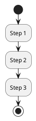
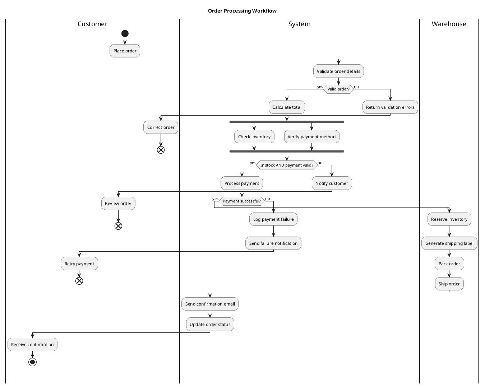

# PlantUML Activity Diagram Reference

Activity diagrams show workflows, business processes, and algorithmic flows with control structures.

**Note**: PlantUML supports two activity diagram syntaxes. This reference uses the modern syntax (recommended).

---

## Basic Syntax



Activities are enclosed in `:` and `;`.

## Start and End

| Keyword | Meaning |
|---------|---------|
| `start` | Start node (filled circle) |
| `stop` | Stop node (filled circle with ring) |
| `end` | End node (cross) — use for error termination |

## Conditional (if/else)

```plantuml
if (Condition?) then (yes)
    :Action A;
else (no)
    :Action B;
endif
```

### Chained Conditions (elseif)

```plantuml
if (Status?) then (active)
    :Process active;
elseif (Status?) then (pending)
    :Process pending;
elseif (Status?) then (error)
    :Handle error;
else (unknown)
    :Log warning;
endif
```

## Switch/Case

```plantuml
switch (Payment Type?)
case (Card)
    :Process card;
case (Bank Transfer)
    :Process transfer;
case (Digital Wallet)
    :Process wallet;
endswitch
```

## Loops

### While Loop

```plantuml
while (More items?) is (yes)
    :Process item;
endwhile (no)
```

### Repeat Loop

```plantuml
repeat
    :Read data;
    :Process data;
repeat while (More data?) is (yes) not (no)
```

## Parallel Processing (Fork/Join)

```plantuml
fork
    :Task A;
fork again
    :Task B;
fork again
    :Task C;
end fork
```

Merge (end fork with different modes):

- `end fork` — synchronisation bar (wait for all)
- `end merge` — merge point (any one completes)

## Swimlanes (Partitions)

```plantuml
|Customer|
start
:Submit order;

|System|
:Validate order;
:Process payment;

|Warehouse|
:Pick items;
:Ship order;

|Customer|
:Receive delivery;
stop
```

## Notes

```plantuml
:Step 1;
note right
    This is a note
    on the right side.
end note

:Step 2;
note left: Short note
```

## Connectors

For complex flows, use connectors to avoid crossing lines:

```plantuml
:Step 1;
(A)
detach

(A)
:Step 2;
```

## Activity Styling

### Colour and Shape

```plantuml
:Normal activity;
#LightBlue:Coloured activity;
#Pink:Error handling|
```

Activity shapes:

- `:text;` — rounded rectangle (default)
- `:text|` — vertical bar (for signals)
- `:text<` — arrow pointing left (receive)
- `:text>` — arrow pointing right (send)
- `:text/` — slanted (for data/IO)
- `:text]` — indented right
- `:text}` — curly right

## Groups

```plantuml
group Initialisation
    :Load config;
    :Connect to database;
    :Verify credentials;
end group
```

## Detach

Use `detach` to indicate a flow that doesn't continue:

```plantuml
if (Valid?) then (yes)
    :Continue;
else (no)
    :Return error;
    detach
endif
:Next step;
```

## Complete Example



## Skinparam Options

```plantuml
skinparam activity {
    BackgroundColor #FFFFFF
    BorderColor #333333
    FontColor #333333
    ArrowColor #333333
    DiamondBackgroundColor #FFFFCC
    DiamondBorderColor #333333
}

skinparam partition {
    BackgroundColor #F5F5F5
    BorderColor #CCCCCC
}
```
