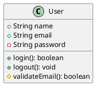
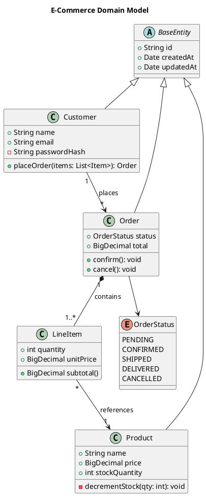

# PlantUML Class Diagram Reference

Class diagrams show the structure of a system by displaying classes, attributes, methods, and their relationships.

---

## Basic Class



## Visibility Modifiers

| Symbol | Visibility |
|--------|-----------|
| `+` | Public |
| `-` | Private |
| `#` | Protected |
| `~` | Package-private |

## Field and Method Syntax

```plantuml
class Account {
    ' Fields
    +String id
    -BigDecimal balance
    #Date createdAt
    ~String internalCode

    ' Methods
    +deposit(amount: BigDecimal): void
    +withdraw(amount: BigDecimal): boolean
    -validate(): void
    #{static} findById(id: String): Account
    +{abstract} calculateInterest(): BigDecimal
}
```

## Abstract Classes and Interfaces

```plantuml
abstract class Shape {
    +{abstract} area(): double
    +{abstract} perimeter(): double
}

interface Drawable {
    +draw(): void
    +resize(factor: double): void
}

interface Serializable {
    +serialize(): String
}
```

## Relationships

| Syntax | Relationship | Description |
|--------|-------------|-------------|
| `A <\|-- B` | Inheritance | B extends A |
| `A <\|.. B` | Implementation | B implements A |
| `A *-- B` | Composition | B is part of A (strong) |
| `A o-- B` | Aggregation | B belongs to A (weak) |
| `A --> B` | Association | A uses B |
| `A ..> B` | Dependency | A depends on B |
| `A -- B` | Link | Simple connection |

### Direction Control

Add direction to relationships:

```plantuml
A -up-|> B
A -down-|> B
A -left-|> B
A -right-|> B
```

### Labels and Cardinality

```plantuml
Customer "1" --> "*" Order: places
Order "1" *-- "1..*" LineItem: contains
Order "0..1" --> "1" Payment: paid by
```

## Enums

```plantuml
enum OrderStatus {
    PENDING
    PROCESSING
    SHIPPED
    DELIVERED
    CANCELLED
}
```

## Packages and Namespaces

```plantuml
package "Domain" {
    class Order
    class Customer
}

package "Infrastructure" {
    class OrderRepository
    class DatabaseConnection
}

OrderRepository --> Order
```

Namespace syntax:

```plantuml
namespace com.example.domain {
    class User
    class Account
}

namespace com.example.service {
    class UserService
}

com.example.service.UserService --> com.example.domain.User
```

## Notes

```plantuml
class Order {
    +id: String
}

note right of Order
    Orders are immutable
    after confirmation.
end note

note "Shared note" as N1
Order .. N1
```

## Stereotypes

```plantuml
class UserController <<Controller>>
class UserService <<Service>>
class UserRepository <<Repository>>
class User <<Entity>>
```

## Generic Types

```plantuml
class Repository<T> {
    +findById(id: String): T
    +save(entity: T): void
    +delete(entity: T): void
}

class UserRepository extends Repository
```

## Skinparam Options

```plantuml
skinparam class {
    BackgroundColor #FFFFFF
    BorderColor #333333
    ArrowColor #333333
    FontColor #333333
}

skinparam classAttributeIconSize 0
skinparam shadowing false
```

## Complete Example


