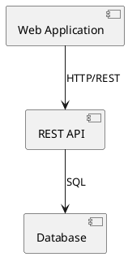
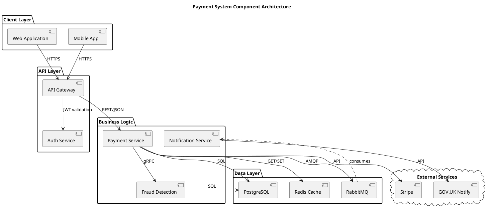

# PlantUML Component Diagram Reference

Component diagrams show the structural relationships between components of a system.

---

## Basic Syntax



## Component Declaration

### Simple Components

```plantuml
component WebApp
component "REST API" as api
component [Another Component]
```

### Components with Stereotypes

```plantuml
component "API Gateway" <<gateway>>
component "Auth Service" <<microservice>>
component "Transaction DB" <<database>>
```

## Interfaces

### Provided Interface (Lollipop)

```plantuml
component "Payment Service" as pay
interface "REST API" as restApi

pay -() restApi
```

### Required Interface (Socket)

```plantuml
component "Web App" as web
interface "Payment API" as payApi

web --( payApi
```

### Interface Connection

```plantuml
component "Web App" as web
component "API" as api
interface "REST" as rest

web --( rest
api -() rest
```

## Packages and Grouping

```plantuml
package "Frontend" {
    component [Web App]
    component [Mobile App]
}

package "Backend" {
    component [API Gateway]
    component [Auth Service]
    component [Payment Service]
}

package "Data" {
    component [PostgreSQL]
    component [Redis]
}
```

### Node (for deployment context)

```plantuml
node "Application Server" {
    component [API]
    component [Service]
}

node "Database Server" {
    component [PostgreSQL]
}
```

### Cloud

```plantuml
cloud "AWS" {
    component [Lambda]
    component [S3]
    component [RDS]
}
```

### Frame, Folder, Database

```plantuml
frame "System Boundary" {
    component [Internal Service]
}

folder "Config" {
    component [Settings]
}

database "Storage" {
    component [Tables]
}
```

## Relationship Types

| Syntax | Line Style | Use For |
|--------|-----------|---------|
| `-->` | Solid arrow | Direct dependency |
| `..>` | Dashed arrow | Indirect dependency, uses |
| `--` | Solid line | Association |
| `..` | Dashed line | Weak association |

### Labels

```plantuml
web --> api: "REST/JSON"
api --> db: "SQL"
api ..> cache: "reads"
```

## Ports

```plantuml
component "Service" as svc {
    port "HTTP" as http
    port "gRPC" as grpc
}

component Client

Client --> svc::http: REST
```

## Notes

```plantuml
component API

note right of API
    Handles all external
    HTTP requests. Rate
    limited to 1000 req/s.
end note

note "Shared component" as N1
```

## Colours and Styling

```plantuml
component "API" #LightBlue
component "Database" #LightGreen
component "External" #LightGray

skinparam component {
    BackgroundColor #FFFFFF
    BorderColor #333333
    FontColor #333333
    ArrowColor #333333
}
```

## Complete Example


