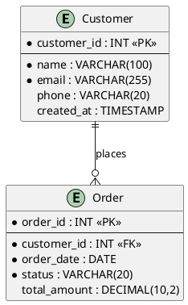
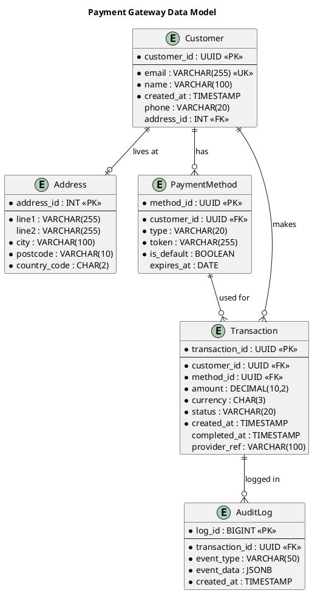

# PlantUML ER Diagram Reference

PlantUML supports Entity-Relationship diagrams for data modelling. Entities are defined with attributes, and relationships connect them with cardinality.

---

## Basic Syntax



## Entity Attributes

### Key Markers

| Marker | Meaning |
|--------|---------|
| `*` | Mandatory (NOT NULL) |
| (no marker) | Optional (nullable) |
| `<<PK>>` | Primary Key |
| `<<FK>>` | Foreign Key |
| `<<UK>>` | Unique Key |

### Separator Lines

- `--` — single line separator (between PKs and other fields)
- `==` — double line separator
- `..` — dotted separator
- `__` — thick separator

### Example with Multiple Key Types

```plantuml
entity "OrderLine" as orderline {
    * order_id : INT <<PK, FK>>
    * line_number : INT <<PK>>
    --
    * product_id : INT <<FK>>
    * quantity : INT
    unit_price : DECIMAL(10,2)
}
```

## Relationships

### Cardinality Notation

| Syntax | Meaning |
|--------|---------|
| `\|o--o\|` | Zero or one to zero or one |
| `\|\|--o{` | Exactly one to zero or many |
| `\|\|--\|\|` | Exactly one to exactly one |
| `}o--o{` | Zero or many to zero or many |
| `\|\|--|{` | Exactly one to one or many |

### Cardinality Symbols

| Symbol | Meaning |
|--------|---------|
| `\|\|` | Exactly one |
| `o\|` | Zero or one |
| `\|{` | One or many |
| `o{` | Zero or many |

### Relationship Labels

```plantuml
customer ||--o{ order : "places"
order ||--|{ orderline : "contains"
product ||--o{ orderline : "appears in"
```

### Direction Control

```plantuml
' Default (left to right)
customer ||--o{ order

' Explicit directions
customer ||--o{ order   ' horizontal
customer ||..o{ order   ' horizontal dotted

' Vertical relationships (use -down-, -up-)
customer ||--o{ order
```

## Notes

```plantuml
entity Customer {
    * id : INT <<PK>>
}

note right of Customer
    Customer records are
    soft-deleted (not removed).
end note
```

## Packages

```plantuml
package "Customer Domain" {
    entity Customer
    entity Address
    Customer ||--o{ Address
}

package "Order Domain" {
    entity Order
    entity OrderLine
    Order ||--|{ OrderLine
}

Customer ||--o{ Order
```

## Colour and Styling

```plantuml
entity Customer #LightBlue {
    * id : INT <<PK>>
    --
    * name : VARCHAR
}

entity Order #LightGreen {
    * id : INT <<PK>>
    --
    * customer_id : INT <<FK>>
}
```

## Complete Example



## Skinparam Options

```plantuml
skinparam entity {
    BackgroundColor #FFFFFF
    BorderColor #333333
    FontColor #333333
}

skinparam linetype ortho
```

**Tip**: `skinparam linetype ortho` forces orthogonal (right-angle) lines, which is often cleaner for ER diagrams.
