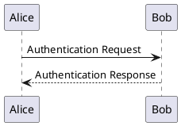
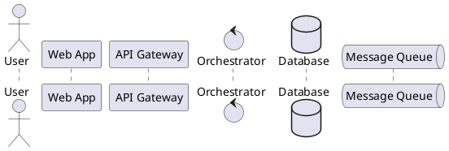
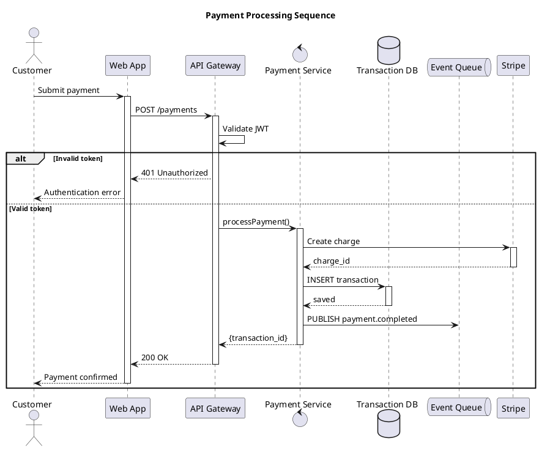

# PlantUML Sequence Diagram Reference

Sequence diagrams show interactions between participants over time.

---

## Basic Syntax



## Participant Types

| Keyword | Shape | Use For |
|---------|-------|---------|
| `participant` | Box | Default — services, components |
| `actor` | Stick figure | Human users |
| `boundary` | Boundary icon | System boundaries, controllers |
| `control` | Control circle | Business logic, orchestrators |
| `entity` | Entity icon | Domain entities, data objects |
| `database` | Cylinder | Databases, data stores |
| `collections` | Stack icon | Collections, arrays, lists |
| `queue` | Queue icon | Message queues, event streams |

### Declaration Examples



## Arrow Types

| Arrow | Meaning |
|-------|---------|
| `->` | Synchronous solid message |
| `-->` | Synchronous dashed (return) |
| `->>` | Asynchronous solid message |
| `-->>` | Asynchronous dashed (return) |
| `-\` | Half-headed solid message |
| `--\` | Half-headed dashed message |
| `-[#red]>` | Coloured message |
| `->o` | Message with circle endpoint |
| `->x` | Message with cross (lost message) |

## Grouping

### Alternative (if/else)

```plantuml
alt Success
    API -> DB: Query
    DB --> API: Results
else Failure
    API -> DB: Query
    DB --> API: Error
end
```

### Optional (if)

```plantuml
opt Cache Hit
    API -> Cache: Get
    Cache --> API: Cached data
end
```

### Loop

```plantuml
loop Every 30 seconds
    Monitor -> Service: Health check
    Service --> Monitor: OK
end
```

### Parallel

```plantuml
par Thread 1
    API -> ServiceA: Request A
else Thread 2
    API -> ServiceB: Request B
end
```

### Break

```plantuml
break Rate limit exceeded
    API --> Client: 429 Too Many Requests
end
```

### Critical

```plantuml
critical Payment processing
    API -> PaymentProvider: Charge
    PaymentProvider --> API: Confirmation
end
```

### Group (generic)

```plantuml
group Authentication [OAuth2 flow]
    Client -> Auth: Authorize
    Auth --> Client: Token
end
```

## Notes

```plantuml
note left of Alice: This is a note
note right of Bob: Another note
note over Alice, Bob: Spanning note

note over API
    Multi-line note
    with details
end note
```

## Dividers and References

```plantuml
== Initialization ==
Alice -> Bob: Request
Bob --> Alice: Response

== Main Flow ==
Alice -> Bob: Data

ref over Alice, Bob: See other diagram
```

## Activation and Deactivation

```plantuml
Alice -> Bob: Request
activate Bob
Bob -> Bob: Process
Bob --> Alice: Response
deactivate Bob
```

Shorthand with `++` and `--`:

```plantuml
Alice -> Bob++: Request
Bob --> Alice--: Response
```

Nested activations:

```plantuml
Alice -> Bob++: Request
Bob -> Carol++: Delegate
Carol --> Bob--: Done
Bob --> Alice--: Response
```

## Box Grouping

```plantuml
box "Internal Services" #LightBlue
    participant API
    participant Service
    database DB
end box

box "External" #LightGray
    participant Provider
end box
```

## Return Messages

```plantuml
Alice -> Bob: Request
return Response
```

The `return` keyword automatically creates a dashed return arrow to the last caller.

## Delays and Spacing

```plantuml
Alice -> Bob: Request
...
Bob --> Alice: Delayed response

Alice -> Bob: Another request
|||
Bob --> Alice: After spacing
```

- `...` — delay (shows dotted vertical line)
- `|||` — extra spacing
- `||45||` — specific pixel spacing

## Autonumbering

```plantuml
autonumber
Alice -> Bob: Step 1
Bob -> Carol: Step 2
Carol --> Alice: Step 3
```

Options:

- `autonumber 10` — start from 10
- `autonumber 10 10` — start from 10, increment by 10
- `autonumber "<b>[000]"` — formatted numbering

## Stereotypes and Colours

```plantuml
participant "API" as api <<Service>>
participant "Database" as db <<Storage>> #LightBlue

api -[#red]> db: Critical query
api -[#green]> db: Normal query
```

## Complete Example



## Skinparam Options

```plantuml
skinparam sequenceArrowThickness 2
skinparam roundcorner 5
skinparam maxmessagesize 60
skinparam sequenceParticipant underline
skinparam responseMessageBelowArrow true

skinparam participant {
    BackgroundColor #FFFFFF
    BorderColor #333333
    FontColor #333333
}

skinparam sequence {
    ArrowColor #333333
    LifeLineBorderColor #999999
    LifeLineBackgroundColor #EEEEEE
    GroupBackgroundColor #F5F5F5
}
```
