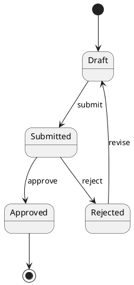
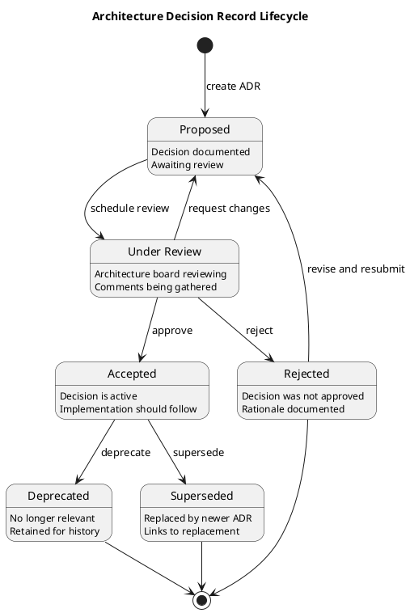

# PlantUML State Diagram Reference

State diagrams show the states an object can be in and the transitions between those states.

---

## Basic Syntax



- `[*]` — initial state (start) or final state (end)
- `-->` — transition arrow
- Text after `:` — transition label/trigger

## State Declaration

### Simple States

```plantuml
state Draft
state "Under Review" as Review
state Approved
state Rejected
```

### States with Descriptions

```plantuml
state Draft {
    Draft: Document is being authored
    Draft: Not yet submitted for review
}

' Or using description block
state "Under Review" as Review {
    Review: Awaiting reviewer approval
}
```

### State with Entry/Exit Actions

```plantuml
state Processing {
    state "entry / validate input" as entry1
    state "exit / log completion" as exit1
}
```

## Composite (Nested) States

```plantuml
state Active {
    [*] --> Running
    Running --> Paused: pause
    Paused --> Running: resume
    Running --> [*]: complete
}

[*] --> Active
Active --> Terminated: terminate
Terminated --> [*]
```

## Concurrent States

Use `--` to separate concurrent regions:

```plantuml
state Active {
    state "Network" as net {
        [*] --> Connected
        Connected --> Disconnected: timeout
        Disconnected --> Connected: reconnect
    }
    --
    state "Processing" as proc {
        [*] --> Idle
        Idle --> Busy: request
        Busy --> Idle: done
    }
}
```

## Transition Details

### Guards (Conditions)

```plantuml
Draft --> Approved: [all checks pass]
Draft --> Rejected: [validation fails]
```

### Actions on Transitions

```plantuml
Idle --> Processing: request / startTimer()
Processing --> Complete: done / stopTimer()
```

### Self-Transitions

```plantuml
Active --> Active: heartbeat
```

## Fork and Join

```plantuml
state fork_state <<fork>>
state join_state <<join>>

[*] --> fork_state
fork_state --> State1
fork_state --> State2

State1 --> join_state
State2 --> join_state

join_state --> [*]
```

## Choice (Decision)

```plantuml
state choice <<choice>>

[*] --> choice
choice --> Approved: [score > 80]
choice --> Review: [score 50-80]
choice --> Rejected: [score < 50]
```

## History States

```plantuml
state Active {
    [H] --> Running
    Running --> Paused
    Paused --> Running
}

Suspended --> Active[H]: resume
```

- `[H]` — shallow history (remembers last sub-state)
- `[H*]` — deep history (remembers nested sub-states)

## Notes

```plantuml
state Active
note right of Active
    This state indicates
    the system is operational.
end note

note left of Draft: Initial state
```

## Stereotypes

```plantuml
state "Processing" as proc <<processing>>
state "Error" as err <<error>>
```

## Colours

```plantuml
state Draft #LightBlue
state Approved #LightGreen
state Rejected #Pink
```

## Complete Example



## Skinparam Options

```plantuml
skinparam state {
    BackgroundColor #FFFFFF
    BorderColor #333333
    FontColor #333333
    ArrowColor #333333
    StartColor #333333
    EndColor #333333
}

skinparam state {
    BackgroundColor<<processing>> #FFFFCC
    BackgroundColor<<error>> #FFCCCC
}
```
