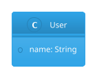
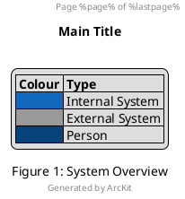

# PlantUML Styling Guide

Control the visual appearance of PlantUML diagrams using skinparams, themes, colours, and formatting options.

---

## 1. Skinparams

Skinparams control the visual properties of diagram elements globally.

### General Skinparams

```plantuml
' Remove shadows
skinparam shadowing false

' Use rounded corners
skinparam roundcorner 10

' Set default font
skinparam defaultFontName "Segoe UI"
skinparam defaultFontSize 12
skinparam defaultFontColor #333333

' Line style
skinparam linetype ortho    ' Right-angle lines
skinparam linetype polyline ' Straight lines with bends

' DPI for output resolution
skinparam dpi 150
```

### Element-Specific Skinparams

```plantuml
' Classes
skinparam class {
    BackgroundColor #FFFFFF
    BorderColor #333333
    FontColor #333333
    ArrowColor #333333
    AttributeFontColor #666666
    StereotypeFontColor #999999
}

' Components
skinparam component {
    BackgroundColor #FFFFFF
    BorderColor #333333
    FontColor #333333
}

' Sequence diagrams
skinparam sequence {
    ArrowColor #333333
    ArrowThickness 1.5
    LifeLineBorderColor #999999
    LifeLineBackgroundColor #F5F5F5
    ParticipantBackgroundColor #FFFFFF
    ParticipantBorderColor #333333
    GroupBackgroundColor #F0F0F0
}

' State diagrams
skinparam state {
    BackgroundColor #FFFFFF
    BorderColor #333333
    ArrowColor #333333
    StartColor #333333
    EndColor #333333
}

' Activity diagrams
skinparam activity {
    BackgroundColor #FFFFFF
    BorderColor #333333
    DiamondBackgroundColor #FFFFCC
    DiamondBorderColor #333333
}

' Notes
skinparam note {
    BackgroundColor #FFFFCC
    BorderColor #CCCC00
    FontColor #333333
}
```

## 2. Colours

### Colour Formats

PlantUML supports multiple colour formats:

```plantuml
' Named colours
component "Red" #Red
component "Blue" #Blue

' Hex colours
component "Custom" #1168BD

' RGB
component "RGB" #RGB(17, 104, 189)

' Gradient
component "Gradient" #LightBlue/LightGreen
```

### C4 Standard Colours

The C4 model uses a standard colour palette:

| Element Type | Hex Colour | Usage |
|-------------|-----------|-------|
| Person | `#08427B` | Dark blue for actors |
| Software System | `#1168BD` | Medium blue for your systems |
| External System | `#999999` | Grey for external systems |
| Container | `#438DD5` | Light blue for containers |
| Component | `#85BBF0` | Lighter blue for components |

### Applying Colours to Specific Elements

```plantuml
' Individual element colouring
component "API" #1168BD
component "External" #999999

' Conditional colouring with stereotypes
skinparam component {
    BackgroundColor<<internal>> #1168BD
    BackgroundColor<<external>> #999999
    FontColor<<internal>> #FFFFFF
    FontColor<<external>> #FFFFFF
}

component "API" <<internal>>
component "Stripe" <<external>>
```

## 3. Themes

### Built-in Themes

PlantUML includes several built-in themes:

```plantuml
!theme cerulean
!theme blueprint
!theme plain
!theme sketchy-outline
!theme black-knight
!theme mars
!theme materia
!theme minty
!theme reddress-lightblue
!theme superhero-outline
!theme toy
!theme vibrant
```

Usage:



### Theme Location

```plantuml
' Built-in theme
!theme cerulean

' Theme from URL
!theme cerulean from https://example.com/themes

' Local theme file
!theme mytheme from /path/to/themes
```

## 4. Fonts

```plantuml
skinparam defaultFontName "Segoe UI"
skinparam defaultFontSize 12
skinparam defaultFontStyle plain

' Element-specific fonts
skinparam classFontName "Consolas"
skinparam classFontSize 11
skinparam classFontStyle bold

skinparam titleFontName "Segoe UI"
skinparam titleFontSize 18
skinparam titleFontStyle bold
skinparam titleFontColor #333333
```

## 5. Arrows and Lines

```plantuml
' Arrow thickness
skinparam ArrowThickness 1.5

' Arrow colour
skinparam ArrowColor #333333

' Line type for all diagrams
skinparam linetype ortho      ' Right-angle connectors
skinparam linetype polyline   ' Angled connectors

' Specific arrow colours in relationships
A -[#red]-> B: Critical
A -[#green]-> C: Normal
A -[dashed]-> D: Optional
A -[bold]-> E: Important
A -[dotted]-> F: Weak
```

## 6. Headers, Footers, and Titles



## 7. Legends

```plantuml
legend right
    |= Colour |= Meaning |
    | <#LightGreen> | Healthy |
    | <#Yellow> | Warning |
    | <#Red> | Critical |
endlegend

' Or positioned
legend bottom left
    System architecture overview
endlegend
```

## 8. Sprites and Icons

### Built-in Sprites

```plantuml
' List available sprites
listsprites

' Use a sprite
component "<$database>" as db
```

### C4 Icons (via stdlib)

```plantuml
!include <tupadr3/font-awesome-5/server>
!include <tupadr3/font-awesome-5/database>
!include <tupadr3/font-awesome-5/cloud>

component "<$server>\nWeb Server" as web
component "<$database>\nDatabase" as db
component "<$cloud>\nCloud" as cloud
```

### AWS Icons

```plantuml
!include <awslib/AWSCommon>
!include <awslib/Compute/Lambda>
!include <awslib/Storage/SimpleStorageService>
!include <awslib/Database/RDS>
```

## 9. Preprocessor Directives

```plantuml
' Variables
!$system_name = "Payment Gateway"
title $system_name Architecture

' Conditional
!ifdef DETAILED
    class DetailedView
!else
    class SimpleView
!endif

' Include
!include common-styles.puml

' Functions
!function $highlight($text)
    <b><color:#FF0000>$text</color></b>
!endfunction
```

## 10. Page and Size Control

```plantuml
' Set output size
scale 1.5
scale max 1024 width
scale max 768 height

' Page breaks for large diagrams
page 2x2

' Landscape
skinparam pageMargin 10
```

## 11. ArcKit Recommended Style

For ArcKit architecture diagrams, use this base style:

```plantuml
@startuml
' --- ArcKit Standard Style ---
skinparam shadowing false
skinparam roundcorner 5
skinparam defaultFontName "Segoe UI"
skinparam defaultFontSize 12
skinparam linetype ortho

skinparam component {
    BackgroundColor #FFFFFF
    BorderColor #333333
    FontColor #333333
}

skinparam note {
    BackgroundColor #FFFFCC
    BorderColor #CCCC00
}

skinparam ArrowColor #333333
skinparam ArrowThickness 1.5

title Diagram Title
footer Generated by ArcKit

' --- Diagram content here ---
@enduml
```



For C4 diagrams, the C4-PlantUML library provides its own styling. Avoid overriding C4 colours unless matching a specific corporate style guide.
