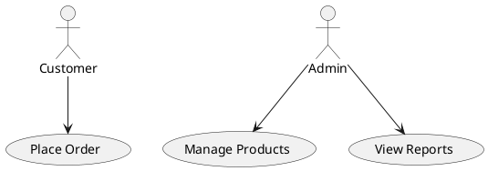
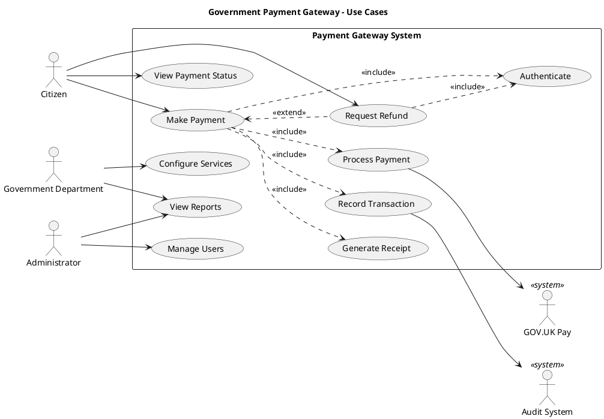

# PlantUML Use Case Diagram Reference

Use case diagrams show the interactions between actors and the system's use cases.

---

## Basic Syntax



## Actors

### Actor Types

```plantuml
actor "Customer" as customer
actor "Admin" as admin
actor "External System" as ext <<system>>

' Alternative actor syntax (stick figure vs rectangle)
:Customer:
:Admin:
```

### Actor Stereotypes

```plantuml
actor "Human User" <<human>>
actor "API Client" <<system>>
actor "Batch Job" <<automated>>
```

## Use Cases

### Simple Declaration

```plantuml
usecase UC1 as "Place Order"
usecase UC2 as "Process Payment"
usecase UC3 as "Send Notification"
```

### Use Case with Description

```plantuml
usecase UC1 as "Place Order
--
Customer selects items,
provides delivery address,
and confirms payment."
```

## Relationships

### Association (Actor to Use Case)

```plantuml
Customer --> (Place Order)
(Place Order) --> PaymentSystem
```

### Include

```plantuml
(Place Order) ..> (Validate Address): <<include>>
(Place Order) ..> (Process Payment): <<include>>
```

### Extend

```plantuml
(Place Order) <.. (Apply Discount): <<extend>>
(Place Order) <.. (Gift Wrap): <<extend>>
```

### Generalisation

```plantuml
' Actor generalisation
Admin --|> User

' Use case generalisation
(Pay by Card) --|> (Make Payment)
(Pay by Bank) --|> (Make Payment)
```

## System Boundary

```plantuml
rectangle "Online Shopping System" {
    usecase "Browse Catalogue" as UC1
    usecase "Place Order" as UC2
    usecase "Track Delivery" as UC3
    usecase "Process Payment" as UC4
}

actor Customer
actor "Payment Gateway" as pg

Customer --> UC1
Customer --> UC2
Customer --> UC3
UC2 ..> UC4: <<include>>
UC4 --> pg
```

### Nested Boundaries

```plantuml
rectangle "E-Commerce Platform" {
    rectangle "Customer Portal" {
        usecase "Browse" as UC1
        usecase "Order" as UC2
    }

    rectangle "Admin Portal" {
        usecase "Manage Products" as UC3
        usecase "View Reports" as UC4
    }
}
```

## Notes

```plantuml
usecase UC1 as "Place Order"

note right of UC1
    Requires authenticated user.
    Maximum 50 items per order.
end note

note "System scope" as N1
```

## Direction

```plantuml
left to right direction

actor Customer
actor Admin

rectangle System {
    usecase UC1
    usecase UC2
}

Customer --> UC1
Admin --> UC2
```

Default is top-to-bottom. Use `left to right direction` for horizontal layout.

## Colours and Styling

```plantuml
actor Customer #LightBlue
usecase "Place Order" #LightGreen
usecase "Cancel Order" #Pink

skinparam usecase {
    BackgroundColor #FFFFFF
    BorderColor #333333
    ArrowColor #333333
}

skinparam actor {
    BackgroundColor #FFFFFF
    BorderColor #333333
}
```

## Complete Example


