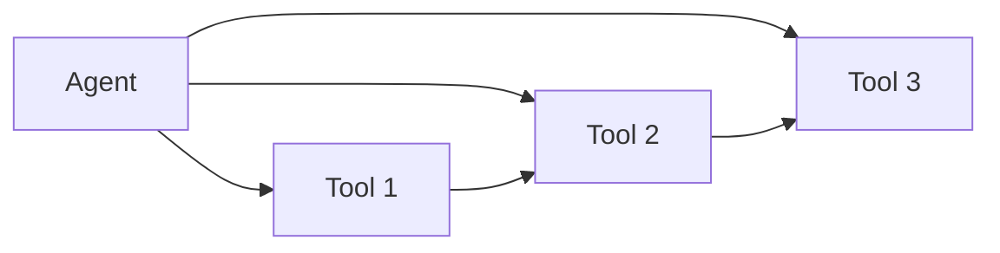
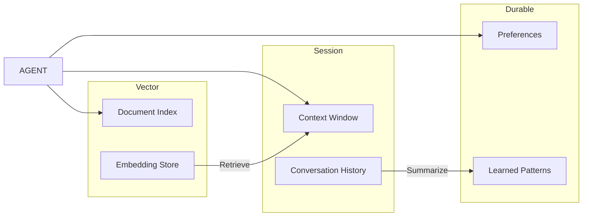
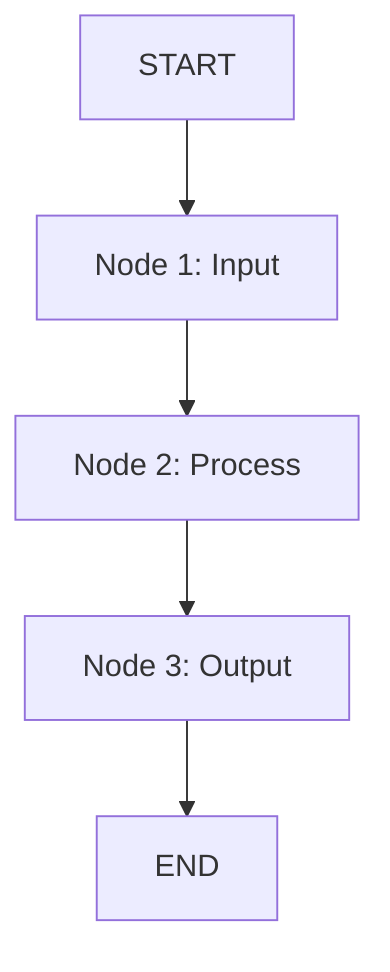
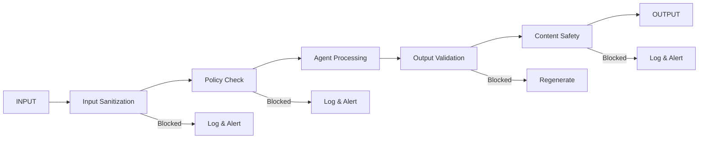

# Agent Architecture Specification

## Document Control

<!-- DOC-CONTROL-HEADER -->
<!-- Resolved at command-execution time to _partials/document-control-uk.md or _partials/document-control-uae.md based on plugin userConfig classification_scheme + governance_framework. See _partials/RENDERING.md (when present). -->

## Revision History

| Version | Date | Author | Changes | Approved By | Approval Date |
|---------|------|--------|---------|-------------|---------------|
| [VERSION] | [DATE] | ArcKit AI | Initial creation from `/arckit:agent-design` command | [PENDING] | [PENDING] |

---

## 1. Agent Architecture Overview

### 1.1 Architecture Pattern

| Pattern | Description | When to Use |
|---------|-------------|-------------|
| Single Agent | [Description] | [Simple tasks, single domain] |
| Chain | [Sequential pipeline] | [Multi-step reasoning] |
| Multi-Agent | [Parallel workers] | [Complex domains, parallelization] |
| Hierarchical | [Supervisor + workers] | [Coordinated multi-agent] |

**Selected Pattern**: [Pattern name]

**Justification**: [Why this pattern was chosen over alternatives, with reference to requirements and domain complexity]

### 1.2 Component Diagram

```mermaid
C4Component
    title Agent Architecture — Component Diagram
    Person(user, "User", "End user")
    System_Boundary(agent, "[Agent Name]")
        Component(llm, "LLM Core", "[Model]")
        Component(tools, "Tool Layer", "[MCP servers]")
        Component(memory, "Memory", "[Session/Durable/Vector]")
        Component(guardrails, "Guardrails", "[Safety layer]")
    Rel(user, llm, "Sends prompts")
    Rel(llm, tools, "Calls tools")
    Rel(llm, memory, "Reads/writes")
    Rel(llm, guardrails, "Subject to")
```

### 1.3 Agent Capabilities

| Capability | Description | Priority |
|------------|-------------|----------|
| [C-001] | [Description] | [Must/Should/Could] |
| [C-002] | [Description] | [Must/Should/Could] |
| [C-003] | [Description] | [Must/Should/Could] |

### 1.4 LLM Configuration

| Setting | Value | Rationale |
|---------|-------|-----------|
| **Model** | [Model name and version] | [Why this model] |
| **Temperature** | [0.0 – 1.0] | [Balancing creativity vs determinism] |
| **Max Tokens** | [Number] | [Output length constraint] |
| **Context Window** | [Tokens] | [Memory capacity requirement] |

---

## 2. Tool Contracts

| Tool ID | Name | Type | Permissions | Input Schema | Output Schema |
|---------|------|------|------------|-------------|---------------|
| T-001 | [Name] | [MCP/REST/Function] | [Read/Write/Execute] | [Schema] | [Schema] |

### 2.1 Tool Details

#### T-001: [Tool Name]

**Type**: [MCP / REST / Function Call / Database]

**Permissions**: [Read / Write / Execute / Admin]

**Description**: [What this tool does and why the agent needs it]

**Input Schema**:

```json
{
  "type": "object",
  "properties": {
    "[parameter]": {
      "type": "[string/number/object]",
      "description": "[Description]",
      "required": [true/false]
    }
  }
}
```

**Output Schema**:

```json
{
  "type": "object",
  "properties": {
    "[result]": {
      "type": "[string/number/object]",
      "description": "[Description]"
    }
  }
}
```

**Error Handling**: [How the agent handles tool failures, retries, timeouts]

**Rate Limits**: [Request limits, burst limits, quotas]

### 2.2 Tool Dependency Graph



---

## 3. Memory Architecture

| Layer | Type | Storage | Retention | Access |
|-------|------|---------|-----------|--------|
| Session | Ephemeral | In-memory | Session only | Read/Write |
| Durable | Persistent | [DB] | [Indefinite] | Read/Write |
| Vector | Semantic | [Vector DB] | [Configurable] | Search |

### 3.1 Session Memory

**Purpose**: Short-term context within a single conversation

**Storage**: In-memory context window

**Capacity**: [Max tokens/messages in context window]

**Scope**: Single session, cleared on disconnect

**Access Pattern**: LRU eviction when context limit reached

### 3.2 Durable Memory

**Purpose**: Cross-session persistence of preferences, decisions, and learned behaviors

**Storage**: [Database technology — e.g., SQLite, PostgreSQL, Redis]

**Schema**:
| Field | Type | Description |
|-------|------|-------------|
| `id` | UUID | Unique memory entry |
| `agent_id` | String | Agent this memory belongs to |
| `key` | String | Memory key/label |
| `value` | JSON | Memory content |
| `created_at` | Timestamp | When stored |
| `updated_at` | Timestamp | Last modified |
| `expires_at` | Timestamp | TTL or null for permanent |

**Retention Policy**: [e.g., 90 days, indefinite, user-controlled]

### 3.3 Vector Memory

**Purpose**: Semantic search and retrieval of relevant information

**Storage**: [Vector database — e.g., Chroma, Pinecone, Weaviate]

**Embedding Model**: [Model name and dimensions]

**Index Type**: [HNSW / IVF / Flat]

**Retrieval Strategy**: [Top-K, similarity threshold, MMR]

**Retrieval Schema**:
| Parameter | Value | Description |
|-----------|-------|-------------|
| `top_k` | [Number] | Results returned per query |
| `similarity_threshold` | [0.0–1.0] | Minimum relevance score |
| `namespace` | [Scope] | Query scope (session/project/global) |

### 3.4 Memory Flow Diagram



---

## 4. Orchestration Design

| Component | Framework | Role | Handoff |
|-----------|-----------|------|--------|
| [Node 1] | [LangGraph/CrewAI/etc] | [Role] | [To Node 2] |

### 4.1 Orchestration Flow



### 4.2 Node Definitions

#### Node 1: [Name]

**Role**: [Input validation, prompt construction, task routing]

**Inputs**: [User query, context, tool results]

**Outputs**: [Validated request, structured task]

**Guardrails**: [Input checks applied here]

#### Node 2: [Name]

**Role**: [Tool invocation, reasoning, knowledge retrieval]

**Inputs**: [Task from Node 1, memory context]

**Outputs**: [Results, intermediate findings]

**Guardrails**: [Tool output validation]

#### Node 3: [Name]

**Role**: [Response formatting, quality check, output delivery]

**Inputs**: [Results from Node 2]

**Outputs**: [Final response to user]

**Guardrails**: [Output validation, safety check]

### 4.3 State Management

| State Variable | Type | Persistence | Description |
|----------------|------|-------------|-------------|
| `task_id` | String | Session | Current task identifier |
| `context` | Object | Session | Current context window |
| `tool_history` | Array | Session | Recent tool calls and results |
| `preferences` | Object | Durable | User preferences |
| `metrics` | Object | Durable | Performance tracking |

### 4.4 Error Handling and Retries

| Error Type | Strategy | Max Retries | Backoff |
|------------|----------|------------|---------|
| Tool failure | Retry with exponential backoff | [3] | [1s, 2s, 4s] |
| Rate limit | Wait and retry | [5] | [5s, 15s, 30s] |
| LLM timeout | Retry with reduced context | [2] | [Immediate, 1s] |
| Guardrail block | Fallback response | [0] | [None] |

---

## 5. Guardrail Configuration

| Guardrail | Type | Threshold | Action |
|-----------|------|-----------|--------|
| Output validation | [Regex/LLM/Heuristic] | [Threshold] | [Block/Flag/Reroute] |

### 5.1 Input Guardrails

| Guardrail | Check | Pattern | Action |
|-----------|-------|---------|--------|
| Prompt injection | Semantic + regex | [Patterns] | Block and log |
| Input length | Heuristic | [Max tokens] | Truncate or reject |
| Sensitive data | Regex | [PII patterns] | Redact and proceed |
| Malformed input | Schema validation | [JSON schema] | Request correction |

### 5.2 Output Guardrails

| Guardrail | Check | Pattern | Action |
|-----------|-------|---------|--------|
| Content safety | LLM classifier | [Policy] | Block and report |
| Format compliance | Schema validation | [Expected schema] | Reroute to regeneration |
| Hallucination check | Confidence scoring | [Threshold] | Flag and request source |
| PII leakage | Regex detection | [PII patterns] | Redact output |

### 5.3 Safety Pipeline



---

## 6. Testing Strategy

| Test Type | Coverage | Tool |
|-----------|----------|------|
| Unit | Tool contracts | pytest |
| Integration | Agent flow | [Framework] |
| Security | Prompt injection | [Tool] |

### 6.1 Unit Tests

| Test ID | Target | Input | Expected Output |
|---------|--------|-------|-----------------|
| UT-001 | T-001 tool | [Valid input] | [Expected schema] |
| UT-002 | T-001 tool | [Invalid input] | [Error handling] |
| UT-003 | Memory write | [Key-value pair] | [Persisted] |
| UT-004 | Memory search | [Query] | [Relevant results] |

### 6.2 Integration Tests

| Test ID | Scenario | Steps | Expected Result |
|---------|----------|-------|-----------------|
| IT-001 | Full agent flow | [User query → Agent → Tool → Response] | [Correct answer with source] |
| IT-002 | Multi-turn conversation | [Query → Follow-up → Resolution] | [Context maintained] |
| IT-003 | Tool failure recovery | [Valid → Failed → Retry → Success] | [Graceful handling] |

### 6.3 Security Tests

| Test ID | Attack Vector | Method | Expected Result |
|---------|---------------|--------|-----------------|
| ST-001 | Prompt injection | [Direct injection] | [Blocked] |
| ST-002 | Indirect injection | [Data poisoning] | [Detected] |
| ST-003 | Tool abuse | [Permission escalation] | [Blocked] |
| ST-004 | Data exfiltration | [Query engineering] | [Redacted] |

### 6.4 Performance Tests

| Test ID | Metric | Target | Measurement |
|---------|--------|--------|-------------|
| PT-001 | Response latency | < [X]s p95 | [Tool] |
| PT-002 | Throughput | > [Y] req/min | [Tool] |
| PT-003 | Context utilization | < [Z]% window | [Monitoring] |

---

## 7. Traceability

| Source Artifact | Reference | How It Informs This Design |
|-----------------|-----------|------------------------------|
| AAGI (Agent Inventory) | ARC-{P}-AAGI-v{VERSION} | [Existing agents, capabilities, and operational context referenced] |
| REQ (Requirements) | ARC-{P}-REQ-v{VERSION} | [FR-xxx, NFR-xxx mapped to capabilities] |
| RISK (Risk Register) | ARC-{P}-RISK-v{VERSION} | [R-xxx risks addressed by guardrails] |
| PRIN (Architecture Principles) | ARC-000-PRIN-v{VERSION} | [Principles influencing design choices] |
| STKE (Stakeholder Analysis) | ARC-{P}-STKE-v{VERSION} | [Stakeholder needs driving agent design] |

---

> **Generated by**: ArcKit `/arckit:agent-design` command
> **Generated on**: [DATE] [TIME] GMT
> **ArcKit Version**: [VERSION]
> **Project**: [PROJECT_NAME] (Project [PROJECT_ID])
> **AI Model**: [MODEL_NAME]
> **Generation Context**: [SOURCE_DOCUMENTS]
