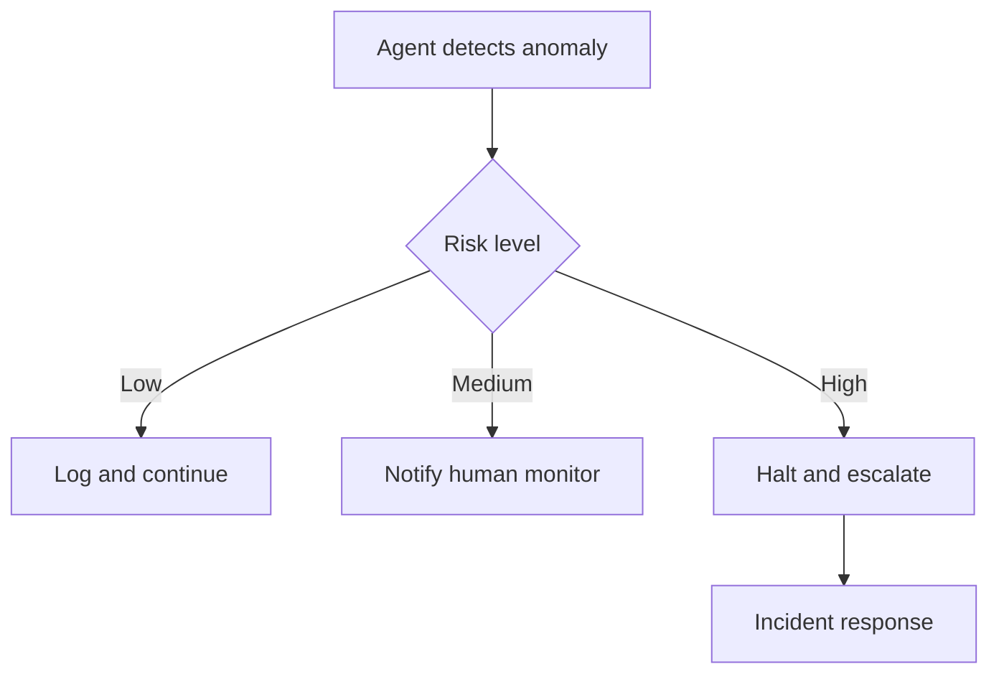

# Agent Governance Framework

## Document Control

[Standard: ID=ARC-{P}-AAOV-v{VERSION}]

---

## 1. Oversight Model

### 1.1 Oversight Tiers

| Tier | Model | When Applied | Human Role |
|------|-------|-------------|-----------|
| Tier 1 | Human-in-the-loop | High-risk decisions, output to end users | Approves each action |
| Tier 2 | Human-on-the-loop | Routine operations with monitoring | Reviews dashboards, intervenes if needed |
| Tier 3 | Human-out-of-the-loop | Automated, auditable tasks | Post-facto audit |

### 1.2 Oversight Assignment

| Agent ID | Risk Level | Oversight Tier | Justification |
|----------|-----------|---------------|---------------|
| AGT-001 | [Critical] | [Tier 1] | [Justification] |

## 2. Approval Matrix

| Risk Tier | Decision Type | Approver | SLA | Escalation |
|-----------|---------------|----------|-----|-----------|
| Critical | All | [Named person + Board] | [1 business day] | [Board Chair] |
| High | Operational | [Team lead] | [4 hours] | [Director] |
| Medium | Automated | [System] | [Immediate] | [Team lead] |
| Low | Fully automated | [Agent] | [Immediate] | [Monitor] |

## 3. Audit Requirements

| Audit Type | Frequency | Scope | Retention |
|------------|-----------|-------|-----------|
| Full audit | Quarterly | All agent actions | [2 years] |
| Spot check | Weekly | Sample of outputs | [1 year] |
| Security audit | Monthly | Security-relevant actions | [3 years] |

## 4. Monitoring KPIs

| KPI | Target | Current | Status |
|-----|--------|---------|--------|
| Approval rate | [>95%] | [98%] | ✅ |
| Escalation rate | [<5%] | [3%] | ✅ |
| Mean time to audit | [<24h] | [12h] | ✅ |

## 5. Escalation Procedures

## 6. Incident Response Plan

| Phase | Action | Owner | Timeline |
|-------|--------|-------|----------|
| Detection | [Auto-monitoring triggers] | [System] | [Immediate] |
| Containment | [Isolate agent] | [SRE] | [<15 min] |
| Assessment | [Determine scope] | [Lead architect] | [<1h] |
| Resolution | [Apply fix] | [Team] | [<4h] |
| Post-mortem | [Root cause, prevention] | [Team] | [<1 week] |

## 7. Compliance Mapping

| Framework | Requirement | Status | Evidence |
|-----------|-------------|--------|----------|
| UK AI Playbook | [Req ID] | [Compliant/Partial] | [Evidence] |
| EU AI Act | [Annex] | [Compliant/Partial] | [Evidence] |
| NIST AI RMF | [Function] | [Compliant/Partial] | [Evidence] |

## 8. Traceability

[AAGI → AAGR → AAOV links]

---
[Generation footer]
