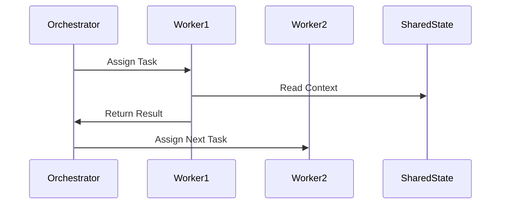

# Agent Integration Architecture

## Document Control

| Field | Value |
|-------|-------|
| Document ID | ARC-{P}-AAIN-v{VERSION} |
| Document Type | AAIN — Agent Integration Architecture |
| Project | {PROJECT_NAME} ({PROJECT_ID}) |
| Classification | {CLASSIFICATION} |
| Status | {STATUS} |
| Version | {VERSION} |
| Created | {DATE} |
| Last Modified | {DATE} |
| Review Cycle | Monthly |
| Next Review | {NEXT_REVIEW_DATE} |
| Owner | {OWNER_NAME_AND_ROLE} |
| Reviewed By | — |
| Approved By | — |
| Distribution | Architecture Team, AI Programme Board |

---

## 1. Integration Architecture

### 1.1 Overview

[Overview of multi-agent system — purpose, scope, and agents involved]

### 1.2 Integration Pattern

| Pattern | Description | When to Use |
|---------|-------------|-------------|
| Event-Driven | Agents communicate via events | Async, decoupled |
| Request-Response | Direct synchronous calls | Tight coupling, real-time |
| Message Queue | Asynchronous message passing | Buffered processing |
| Shared State | Common state repository | Coordinated state |

> **Selected patterns**: [List selected patterns with justification]

---

## 2. Inter-Agent Contracts

| Contract ID | Source Agent | Target Agent | Interface | Protocol | SLA |
|-------------|------------|--------------|----------|----------|-----|
| CNT-001 | [Agent A] | [Agent B] | [Interface] | [gRPC/HTTP/Queue] | [<1s] |
| CNT-002 | [Agent A] | [Agent C] | [Interface] | [gRPC/HTTP/Queue] | [<1s] |
| CNT-003 | [Agent B] | [Agent C] | [Interface] | [gRPC/HTTP/Queue] | [<1s] |

> **Minimum**: At least 3 agent contracts must be documented.

### Contract Specification

```json
{
  "contractId": "CNT-001",
  "version": "1.0.0",
  "input": {
    "type": "object",
    "properties": {
      "taskId": { "type": "string" },
      "payload": { "type": "object" }
    }
  },
  "output": {
    "type": "object",
    "properties": {
      "result": { "type": "object" },
      "status": { "type": "string", "enum": ["success", "error"] }
    }
  }
}
```

> **Repeat** contract specifications for each contract (CNT-002, CNT-003, etc.)

---

## 3. Message Protocol



> **Note**: Update participant names and message flows to match actual agents and protocols.

---

## 4. Shared State Design

| Store | Type | Purpose | Access Pattern |
|-------|------|---------|----------------|
| [Redis] | KV store | Session state | Read/Write |
| [PostgreSQL] | Relational | Durable state | Read/Write |
| [Qdrant] | Vector | Semantic search | Search |

> **Note**: Update stores to match actual infrastructure. Document consistency model (eventual/strong) per store.

---

## 5. Failure Isolation

| Boundary | Isolation Level | Failure Mode | Recovery |
|----------|----------------|-------------|----------|
| Agent process | [Container/Process] | [Crash, timeout] | [Restart, retry] |
| Tool execution | [Sandbox/Timeout] | [API failure] | [Fallback, retry] |
| Message delivery | [At-least-once] | [Duplicate] | [Dedup] |

---

## 6. Observability

| Component | Metric | Alert |
|-----------|--------|-------|
| Agent health | [Uptime, latency] | [>99.9% SLA] |
| Message queue | [Depth, throughput] | [Depth > 1000] |
| Error rate | [Failed/Total] | [>1%] |

---

## 7. Traceability

| Source | Reference | Link |
|--------|-----------|------|
| AAGR | [Agent Architecture Specification] | `ARC-{P}-AAGR-v{VER}` |
| AAGI | [Agent Inventory] | `ARC-{P}-AAGI-v{VER}` |
| AAOV | [Agent Governance Framework] | `ARC-{P}-AAOV-v{VER}` |
| AASE | [Agent Security Architecture] | `ARC-{P}-AASE-v{VER}` |

---

## Revision History

| Version | Date | Author | Changes | Approved By | Approval Date |
|---------|------|--------|---------|-------------|--------------|
| 1.0 | {DATE} | ArcKit AI | Initial creation from `/arckit:agent-integration` command | — | — |

---

**Generated by**: ArcKit `/arckit:agent-integration` command
**Generated on**: {DATE}
**ArcKit Version**: {ARCKIT_VERSION}
**Project**: {PROJECT_NAME} (Project {PROJECT_ID})
**AI Model**: [Model Name]
