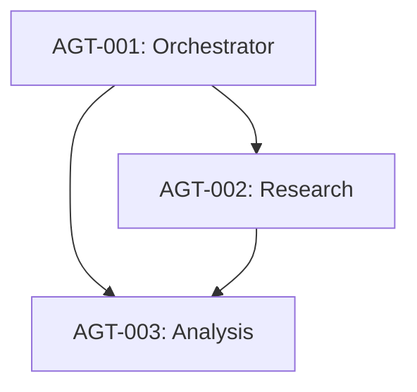

# AI Agent Inventory

## Document Control

| Field | Value |
|-------|-------|
| Document ID | ARC-{P}-AAGI-v{VERSION} |
| Document Type | AAGI — AI Agent Inventory |
| Project | {PROJECT_NAME} ({PROJECT_ID}) |
| Classification | {CLASSIFICATION} |
| Status | {STATUS} |
| Version | {VERSION} |
| Created | {DATE} |
| Last Modified | {DATE} |
| Review Cycle | Monthly |
| Next Review | {NEXT_REVIEW_DATE} |
| Owner | {OWNER_NAME_AND_ROLE} |
| Reviewed By | — |
| Approved By | — |
| Distribution | Architecture Team, AI Programme Board |

---

## 1. Agent Register

| Agent ID | Name | Purpose | Model | Deployment | Owner | Risk Level | Oversight |
|----------|------|---------|-------|-----------|-------|------------|-----------|
| AGT-001 | [Agent Name] | [Brief purpose description] | [GPT-4/Claude/etc] | [Prod/Staging/Dev/Planned] | [Owner Name/Role] | [Critical/High/Med/Low] | [Human-in-the-loop/on-the-loop/out-of-loop] |
| AGT-002 | [Agent Name] | [Brief purpose description] | [Model] | [Env] | [Owner] | [Risk] | [Oversight] |
| AGT-003 | [Agent Name] | [Brief purpose description] | [Model] | [Env] | [Owner] | [Risk] | [Oversight] |

> **Minimum**: At least 3 agents must be documented. If fewer exist, ask user to confirm scope.

## 2. Capability Matrix

| Agent ID | Tools | Skills | Memory | Output Types |
|----------|-------|--------|--------|-------------|
| AGT-001 | [tool1, tool2, MCP client] | [skill1, skill2] | [Session/Durable/Vector/Episodic] | [Text/API/File/Action] |
| AGT-002 | [tool1, tool2] | [skill1] | [Session/Vector] | [Text/API] |
| AGT-003 | [tool1, tool2, tool3] | [skill1, skill2] | [Durable/Vector] | [Text/File] |

## 3. Agent Dependencies

> **Note**: Update agent IDs and labels to match actual agents. Show all agent-to-agent communication paths, including data flows and orchestration chains.

## 4. Security Classification

| Agent ID | Data Sensitivity | Access Level | Isolation | Audit Required |
|----------|----------------|-------------|-----------|----------------|
| AGT-001 | [High/Med/Low] | [Full/Read/None] | [Sandboxed/Container/Native] | [Yes/No] |
| AGT-002 | [High/Med/Low] | [Full/Read/None] | [Sandboxed/Container/Native] | [Yes/No] |
| AGT-003 | [High/Med/Low] | [Full/Read/None] | [Sandboxed/Container/Native] | [Yes/No] |

## 5. Agent Lifecycle

| Agent ID | Status | Created | Last Updated | Version |
|----------|--------|---------|-------------|---------|
| AGT-001 | [Active/In Development/Deprecating/Retired] | [YYYY-MM-DD] | [YYYY-MM-DD] | [vX.Y] |
| AGT-002 | [Active/In Development/Deprecating/Retired] | [YYYY-MM-DD] | [YYYY-MM-DD] | [vX.Y] |
| AGT-003 | [Active/In Development/Deprecating/Retired] | [YYYY-MM-DD] | [YYYY-MM-DD] | [vX.Y] |

## 6. Oversight Model

| Agent ID | Oversight Level | Approval Gates | Monitoring | Escalation |
|----------|----------------|---------------|------------|------------|
| AGT-001 | [Human-in-the-loop/on-the-loop/out-of-loop] | [Gate descriptions] | [Dashboard/Alert/Audit] | [Criteria] |
| AGT-002 | [Human-in-the-loop/on-the-loop/out-of-loop] | [Gate descriptions] | [Dashboard/Alert/Audit] | [Criteria] |
| AGT-003 | [Human-in-the-loop/on-the-loop/out-of-loop] | [Gate descriptions] | [Dashboard/Alert/Audit] | [Criteria] |

## 7. Traceability

| Source | Reference | Link |
|--------|-----------|------|
| ADMP | [ADM Preliminary / Architecture Vision] | `ARC-{P}-ADMP-v{VER}` |
| APP | [Application Inventory] | `ARC-{P}-APP-v{VER}` |
| PRIN | [Principles] | `ARC-000-PRIN-v{VER}` |
| AAGR | [Agent Architecture Specification] | `ARC-{P}-AAGR-v{VER}` |
| AAOV | [Agent Governance Framework] | `ARC-{P}-AAOV-v{VER}` |
| AASE | [Agent Security Architecture] | `ARC-{P}-AASE-v{VER}` |

---

## Revision History

| Version | Date | Author | Changes | Approved By | Approval Date |
|---------|------|--------|---------|-------------|--------------|
| 1.0 | {DATE} | ArcKit AI | Initial creation from `/arckit:agent-inventory` command | — | — |

---

**Generated by**: ArcKit `/arckit:agent-inventory` command
**Generated on**: {DATE}
**ArcKit Version**: {ARCKIT_VERSION}
**Project**: {PROJECT_NAME} (Project {PROJECT_ID})
**AI Model**: [Model Name]
