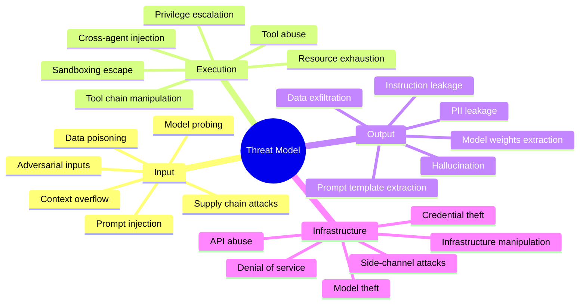
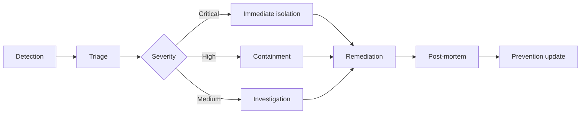

# Agent Security Architecture

## Document Control

<!-- DOC-CONTROL-HEADER -->
<!-- Resolved at command-execution time to _partials/document-control-uk.md or _partials/document-control-uae.md based on plugin userConfig classification_scheme + governance_framework. See _partials/RENDERING.md (when present). -->

## Revision History

| Version | Date | Author | Changes | Approved By | Approval Date |
|---------|------|--------|---------|-------------|---------------|
| [VERSION] | [DATE] | ArcKit AI | Initial creation from `/arckit:agent-security` command | [PENDING] | [PENDING] |

---

## 1. Threat Model

### 1.1 Attack Surface



### 1.2 Threat Summary

| Threat Category | Dimension | Severity | Frequency | Mitigation |
|----------------|-----------|----------|-----------|-----------|
| [Category 1] | [Dimension] | [Critical/High/Med/Low] | [Likelihood] | [Control] |
| [Category 2] | [Dimension] | [Critical/High/Med/Low] | [Likelihood] | [Control] |

---

## 2. Sandboxing Architecture

| Component | Isolation | Enforcement |
|-----------|-----------|-------------|
| Agent process | [Container/Sandbox] | [OS-level] |
| Tool execution | [Separate process] | [Permission boundary] |
| Memory access | [Scoped] | [RBAC] |
| Network access | [API boundary] | [Egress control] |
| Data I/O | [Context sandbox] | [Input/output separation] |

### 2.1 Isolation Layers

| Layer | Technology | Scope | Escape Risk |
|-------|-----------|-------|------------|
| [OS Level] | [Container/Sandbox] | [Agent process] | [Low/Med/High] |
| [App Level] | [Wasm/Virtualisation] | [Tool execution] | [Low/Med/High] |
| [Data Level] | [Encryption/Tokenisation] | [Memory/Data] | [Low/Med/High] |

---

## 3. Tool Permission Matrix

| Tool | Permission | Agent Access | Risk | Mitigation |
|------|-----------|-------------|------|-----------|
| [Tool 1] | [Read/Write/Execute] | [Full/Limited/None] | [Low/Med/High] | [Control] |
| [Tool 2] | [Read/Write/Execute] | [Full/Limited/None] | [Low/Med/High] | [Control] |
| [Tool 3] | [Read/Write/Execute] | [Full/Limited/None] | [Low/Med/High] | [Control] |
| [Tool 4] | [Read/Write/Execute] | [Full/Limited/None] | [Low/Med/High] | [Control] |
| [Tool 5] | [Read/Write/Execute] | [Full/Limited/None] | [Low/Med/High] | [Control] |

---

## 4. Data Handling Policy

| Data Type | Handling | Agent Access | Retention |
|-----------|----------|-------------|-----------|
| PII | [Encrypt at rest, mask in prompts] | [Allowed/Blocked] | [X days] |
| Sensitive | [Encrypted, scoped access] | [Allowed/Blocked] | [X days] |
| Public | [Standard handling] | [Unrestricted] | [X days] |
| Model weights | [Integrity verified, restricted] | [Read-only] | [Indefinite] |

---

## 5. Prompt Injection Defences

| Defence | Method | Coverage |
|---------|--------|----------|
| Input sanitization | [Regex, LLM guard] | [Direct prompts] |
| Context boundary | [System prompt separation] | [Indirect injection] |
| Output validation | [Schema check, content filter] | [Response] |
| Tool call validation | [Permission check, arg validation] | [Tool abuse] |
| [Defence 5] | [Method] | [Coverage] |
| [Defence 6] | [Method] | [Coverage] |

---

## 6. Output Validation Pipeline

```mermaid
flowchart LR
    A[Agent Output] --> B[Schema Validation]
    B --> C[Content Filter]
    C --> D[PII Scanner]
    D --> E[Human Review (if flagged)]
    E --> F[Release]
```

### 6.1 Pipeline Details

| Stage | Check | Action on Failure | Owner |
|-------|-------|-------------------|-------|
| Schema Validation | [Format, structure, type] | [Reject / Flag] | [System] |
| Content Filter | [Policy, safety, compliance] | [Block / Review] | [System] |
| PII Scanner | [Personal data detection] | [Redact / Review] | [System] |
| Human Review | [Manual assessment] | [Approve / Reject] | [Reviewer] |
| Release | [Final gate] | [Deliver / Escalate] | [System] |

---

## 7. Secret Management

| Secret Type | Storage | Access | Rotation |
|-------------|---------|--------|----------|
| API keys | [Hashicorp Vault] | [Scoped] | [90 days] |
| Model credentials | [Secrets manager] | [Scoped] | [90 days] |
| Database credentials | [Vault] | [Scoped] | [30 days] |
| Encryption keys | [HSM / KMS] | [Scoped] | [30 days] |

### 7.1 Secret Lifecycle

| Phase | Action | Automation | Audit |
|-------|--------|-----------|-------|
| Creation | [Generated / Provided] | [Automated] | [Logged] |
| Storage | [Encrypted at rest] | [Vault-managed] | [Access log] |
| Usage | [Scoped, time-limited] | [Injected at runtime] | [Usage log] |
| Rotation | [Automated cycle] | [Scheduled] | [Audit trail] |
| Revocation | [Immediate disable] | [On-demand] | [Event log] |

---

## 8. Incident Response

| Severity | Response Time | Owner | Actions |
|----------|---------------|-------|---------|
| Critical | [<15 min] | [SRE] | [Isolate, investigate, patch] |
| High | [<1h] | [Security] | [Contain, assess, remediate] |
| Medium | [<24h] | [Team] | [Patch, monitor] |
| Low | [<72h] | [Team] | [Log, review, improve] |

### 8.1 Incident Lifecycle



---

## 9. Traceability

| Source | Reference | Link |
|--------|-----------|------|
| AAGI | [Agent Inventory ID] | [Agent list, risk classifications] |
| AAGR | [Agent Design ID] | [Tool contracts, architecture] |
| SEC / SBD | [Secure by Design ID] | [Security controls, threat models] |
| AAOV | [Governance ID] | [Oversight tiers, compliance] |

---

## Generation Metadata

**Generated by**: ArcKit `/arckit:agent-security` command
**Generated on**: [DATE] [TIME] GMT
**ArcKit Version**: [ARCKIT_VERSION]
**Project**: [PROJECT_NAME] (Project [PROJECT_ID])
**AI Model**: [Model name]
**Generation Context**: [Brief note about source documents used]
