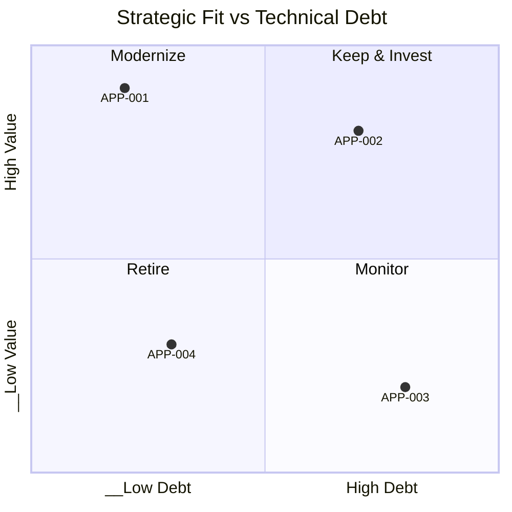
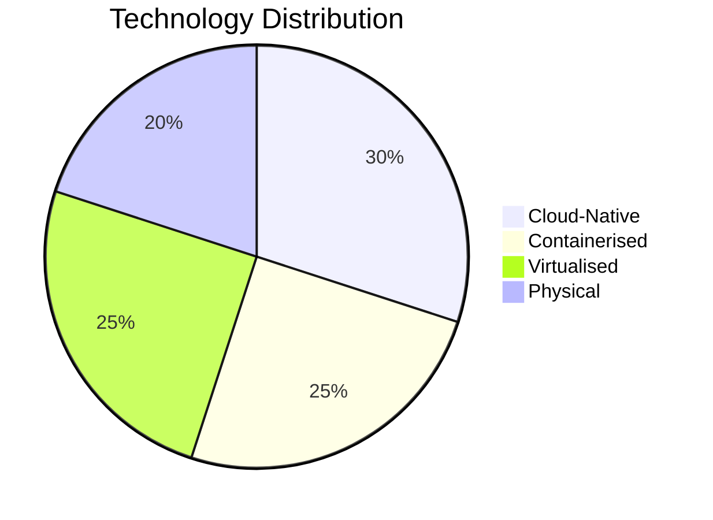
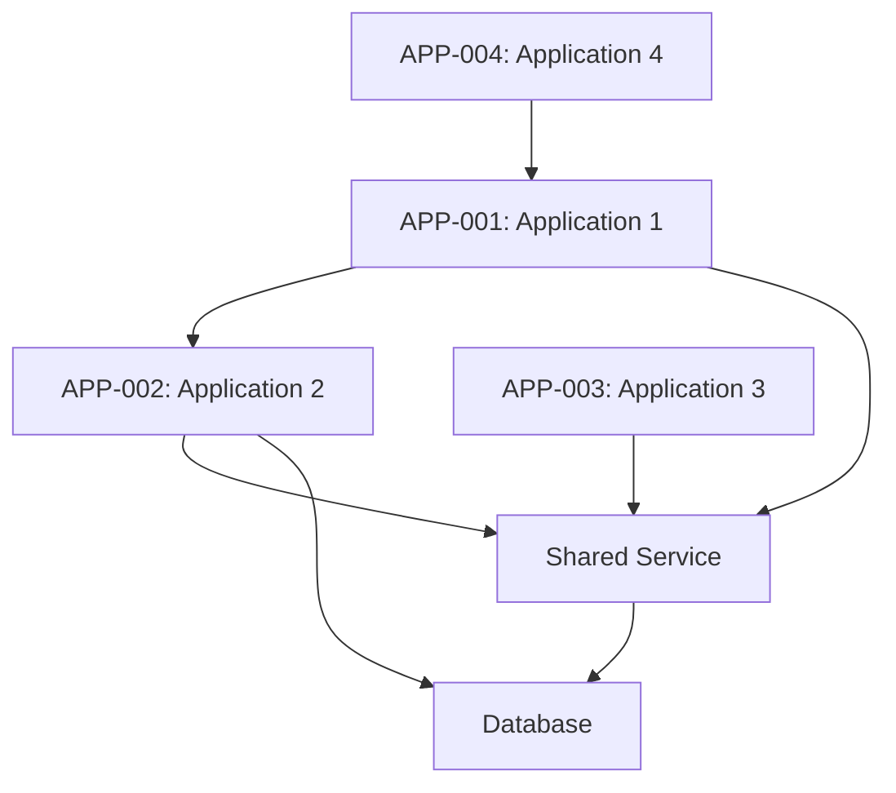
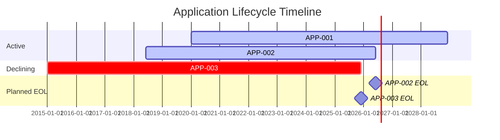

# Application Inventory

## Document Control

| Field | Value |
|-------|-------|
| Document ID | `ARC-[PROJECT_ID]-APP-v[VERSION]` |
| Project | `[PROJECT_NAME]` |
| Owner | `[OWNER_NAME_AND_ROLE]` |
| Classification | `[CLASSIFICATION]` |
| Status | DRAFT |
| Created | `[YYYY-MM-DD]` |
| Review Date | `[YYYY-MM-DD]` |

### Revision History

| Version | Date | Author | Description | Reviewer | Approver |
|---------|------|--------|-------------|----------|----------|
| `[VERSION]` | `[YYYY-MM-DD]` | ArcKit AI | Initial creation | `[REVIEWER_NAME]` | `[APPROVER_NAME]` |

---

## 1. Application Register

| App ID | Name | Category | Owner | Technology | Lifecycle | Status | Strategic Fit |
|--------|------|----------|-------|-----------|-----------|--------|---------------|
| APP-001 | `[Application Name]` | `[Category]` | `[Business Owner]` | `[Technology Stack]` | `[Lifecycle Phase]` | `[Active/Deprecated/Planned]` | `[Strategic/Critical/Support/Replace]` |
| APP-002 | `[Application Name]` | `[Category]` | `[Business Owner]` | `[Technology Stack]` | `[Lifecycle Phase]` | `[Active/Deprecated/Planned]` | `[Strategic/Critical/Support/Replace]` |
| APP-003 | `[Application Name]` | `[Category]` | `[Business Owner]` | `[Technology Stack]` | `[Lifecycle Phase]` | `[Active/Deprecated/Planned]` | `[Strategic/Critical/Support/Replace]` |

> **Categories**: Line-of-Business, Shared Service, Platform, Customer-Facing, Internal Tool, Analytics, Integration, Data Store
>
> **Lifecycle Phases**: Concept, Discovery, Development, Operational, Mature, Declining, Retired
>
> **Strategic Fit**:
>
> - **Strategic** = Core to business strategy, competitive differentiator → *Invest & Grow*
> - **Critical** = Essential for operations, commodity functionality → *Maintain & Optimise*
> - **Support** = Supplementary, low value relative to cost → *Rationalise*
> - **Replace** = High technical debt, misaligned with strategy → *Plan Replacement*

## 2. Strategic Fit Matrix

### Fit Score Rationale

| App ID | Business Value (1-5) | Technical Debt (1-5) | Quadrant | Recommended Action |
|--------|---------------------|---------------------|----------|-------------------|
| APP-001 | [Score] | [Score] | [Quadrant] | [Action] |

## 3. Technology Landscape

### Technology Distribution

### Technology Diversity

| Technology Dimension | Count | Target | Status |
|---------------------|-------|--------|--------|
| Unique Runtimes | [N] | [Target] | [On-track/Over-target] |
| Unique Platforms | [N] | [Target] | [On-track/Over-target] |
| Unique Databases | [N] | [Target] | [On-track/Over-target] |
| Unique Vendors | [N] | [Target] | [On-track/Over-target] |

### Vendor Lock-in Risk

| App ID | Vendor | Lock-in Risk | Exit Strategy |
|--------|--------|-------------|---------------|
| APP-001 | `[Vendor]` | `[High/Medium/Low]` | `[Exit plan]` |

## 4. Application Dependencies

### Dependency Analysis

| Dependency | Source | Target | Type | Criticality |
|------------|--------|--------|------|------------|
| `[Dependency Name]` | `[Source App]` | `[Target App]` | `[API/Database/File Share/Other]` | `[Critical/High/Medium/Low]` |

### Shared Services

| Service | Consumers | Technology | SLA |
|---------|-----------|-----------|-----|
| `[Service Name]` | `[Consumer Apps]` | `[Technology]` | `[SLA Level]` |

## 5. Application-to-Capability Mapping

| App ID | Capability ID | Capability Name | Coverage |
|--------|---------------|-----------------|----------|
| APP-001 | C1.1.1 | `[Capability Name]` | Full |
| APP-002 | C1.2.1 | `[Capability Name]` | Partial |
| APP-003 | C2.1.1 | `[Capability Name]` | Full |

> **Coverage levels**:
>
> - **Full**: Application is the primary/sole system for this capability
> - **Partial**: Application handles some aspects; other systems also contribute
> - **Overlap**: Multiple applications cover the same capability (rationalisation candidate)
>
> **Gaps** (capabilities with no system coverage):
> | Capability ID | Capability Name | Gap Impact |
> |---------------|-----------------|------------|
> | `[C-X.X.X]` | `[Capability]` | `[Impact]` |

## 6. Application Lifecycle

| App ID | Name | Age | EOL Date | Next Major Version | End of Life Plan |
|--------|------|-----|----------|-------------------|------------------|
| APP-001 | `[Name]` | `[Years]` | `[Date / N/A]` | `[Version]` | `[Plan / None]` |
| APP-002 | `[Name]` | `[Years]` | `[Date / N/A]` | `[Version]` | `[Plan / None]` |
| APP-003 | `[Name]` | `[Years]` | `[Date / N/A]` | `[Version]` | `[Plan / None]` |

### Lifecycle Timeline

## 7. Risk Register

| Risk ID | App ID | Risk | Category | Impact | Likelihood | Mitigation |
|---------|--------|------|----------|--------|------------|------------|
| RISK-001 | APP-001 | `[Risk description]` | `[Technical/Operational/Compliance/Strategic]` | `[High/Medium/Low]` | `[High/Medium/Low]` | `[Mitigation]` |
| RISK-002 | APP-002 | `[Risk description]` | `[Technical/Operational/Compliance/Strategic]` | `[High/Medium/Low]` | `[High/Medium/Low]` | `[Mitigation]` |

### Risk Categories

- **Technical**: Unsupported technology, security vulnerabilities, scalability limits, performance degradation
- **Operational**: Single point of failure, lack of skilled staff, poor documentation, vendor dependency
- **Compliance**: Data residency, audit requirements, certification expiry, regulatory changes
- **Strategic**: Misalignment with business direction, market obsolescence, vendor consolidation risk

## 8. Traceability

### Architecture Vision Alignment

| ADMP Element | Application | Alignment | Notes |
|--------------|-------------|-----------|-------|
| `[Scope boundary]` | `[App IDs]` | `[In-scope/Out-of-scope]` | `[Notes]` |

### Capability Coverage Trace

| Source | Reference | Application Link |
|--------|-----------|-----------------|
| BPCM | `ARC-[P]-BPCM-v[VERSION].md` | `[Capability → App mapping summary]` |
| REQ | `ARC-[P]-REQ-v[VERSION].md` | `[Requirement → App mapping summary]` |
| PRIN | `ARC-000-PRIN-v[VERSION].md` | `[Principle → Technology alignment summary]` |

### External References

| Source | Document | Citation |
|--------|----------|----------|
| `[Source]` | `[Document Name]` | `[Reference]` |

## 9. Assumptions

1. `[Assumption about inventory completeness]`
2. `[Assumption about data sources]`
3. `[Assumption about strategic fit ratings]`

## 10. Recommendations

| Priority | Recommendation | Affected Apps | Effort | Impact |
|----------|---------------|---------------|--------|--------|
| `[High/Medium/Low]` | `[Recommendation]` | `[App IDs]` | `[High/Medium/Low]` | `[High/Medium/Low]` |

---

**Generated by**: ArcKit `/arckit:application-inventory` command
**Generated on**: `[DATE] [TIME] GMT`
**ArcKit Version**: `{ARCKIT_VERSION}`
**Project**: `[PROJECT_NAME]` (Project `[PROJECT_ID]`)
