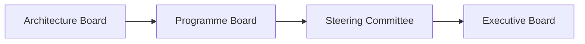

# Architecture Board Charter

## Document Control

| Field | Value |
|-------|-------|
| Document ID | `ARC-[PROJECT_ID]-BORD-v[VERSION]` |
| Project | `[PROJECT_NAME]` |
| Owner | `[OWNER_NAME_AND_ROLE]` |
| Classification | `[CLASSIFICATION]` |
| Status | DRAFT |
| Created | `[YYYY-MM-DD]` |
| Review Date | `[YYYY-MM-DD]` |

### Revision History

| Version | Date | Author | Description | Reviewer | Approver |
|---------|------|--------|-------------|----------|----------|
| `[VERSION]` | `[YYYY-MM-DD]` | ArcKit AI | Initial creation | `[REVIEWER_NAME]` | `[APPROVER_NAME]` |

---

## 1. Board Charter

### 1.1 Purpose

[Purpose statement — why the Architecture Board exists, its mandate, and the governance objectives it serves. Reference TOGAF Phase G — Implementation Governance.]

### 1.2 Scope

**In scope:**

- [Capabilities, domains, projects under the Board's governance]
- [Architecture decisions requiring formal review]
- [Compliance areas the Board oversees]

**Out of scope:**

- [Areas excluded from Board authority]
- [Decisions reserved for other forums]

### 1.3 Authority

| Authority Level | Decision Type | Examples |
|-----------------|---------------|----------|
| Advisory | [Advisory decisions — recommendations only] | [Technology selection guidance, best practice recommendations] |
| Mandatory | [Mandatory decisions — binding on all projects] | [Architecture principle exceptions, security design approval] |
| Exception | [Exception process — formal deviation requests] | [Principle waiver requests, standard deviations] |

---

## 2. Membership

### 2.1 Board Members

| Role | Name | Organisation | Vote Type |
|------|------|--------------|-----------|
| Chair | `[CHAIR_NAME]` | `[CHAIR_ORG]` | Voting |
| CISO | `[CISO_NAME]` | `[CISO_ORG]` | Voting |
| Chief Architect | `[ARCHITECT_NAME]` | `[ARCH_ORG]` | Voting |
| CTO | `[CTO_NAME]` | `[CTO_ORG]` | Voting |
| Programme Sponsor | `[SPONSOR_NAME]` | `[SPONSOR_ORG]` | Observer |
| Compliance Officer | `[COMPLIANCE_NAME]` | `[COMPLIANCE_ORG]` | Observer |

### 2.2 Quorum

[Minimum attendance requirements for valid decisions — e.g., "Minimum 4 voting members present, including the Chair, for decisions to be valid. Decisions made below quorum require retrospective approval at the next meeting."]

---

## 3. Decision Framework

### 3.1 Voting Model

| Model | When Used | Quorum Required |
|-------|-----------|----------------|
| Consensus | Standard decisions — principle alignment, architecture reviews | `[e.g., 75% of voting members]` |
| Majority Vote | Time-sensitive decisions — project gating, resource allocation | `[50% + 1 of voting members]` |
| Chair Decision | Deadlock resolution — when consensus and majority fail | `[Chair decides, documented with rationale]` |

### 3.2 Escalation Path

### 3.3 Decision Recording

All decisions must be recorded in the Decision Register with:

- **Decision ID**: Unique identifier (DEC-BORD-NNN)
- **Topic**: Subject of the decision
- **Decision**: What was decided
- **Rationale**: Why the decision was made
- **Owner**: Who is responsible for implementation
- **Status**: Active / Implemented / Superseded / Under Review

---

## 4. Compliance Scorecard

### 4.1 Current State Assessment

| Domain | Standard/Framework | Current State | Target State | Gap Description | Priority |
|--------|-------------------|---------------|--------------|-----------------|----------|
| Security | NCSC CAF | `[e.g., L3]` | `[e.g., L4]` | `[Gap description]` | `[High]` |
| Data Architecture | DCAM | `[e.g., L2]` | `[e.g., L3]` | `[Gap description]` | `[Medium]` |
| Application Portfolio | TOGAF Standards | `[e.g., L2]` | `[e.g., L3]` | `[Gap description]` | `[Medium]` |
| Technology Standards | `[TCoP / Internal]` | `[e.g., L3]` | `[e.g., L4]` | `[Gap description]` | `[High]` |
| Governance | COBIT 2019 | `[e.g., L2]` | `[e.g., L3]` | `[Gap description]` | `[Low]` |
| Business Alignment | BSM | `[e.g., L3]` | `[e.g., L4]` | `[Gap description]` | `[Medium]` |

### 4.2 Compliance Scoring Methodology

- **Maturity model**: 1 (Initial) → 5 (Optimised)
- **Gap severity**: Delta between current and target maturity
- **Priority scoring**: Gap Size × Business Criticality
- **Review cycle**: Quarterly reassessment

---

## 5. Exception Process

### 5.1 Process Steps

| Step | Action | Owner | Timeline | Approval |
|------|--------|-------|----------|----------|
| 1 | Exception request submitted | Requester | `[T+0]` | Self |
| 2 | Impact assessment completed | Lead Architect | `[T+3 days]` | Architect |
| 3 | Board review and deliberation | Architecture Board | `[T+7 days]` | Board |
| 4 | Formal decision issued | Board Chair | `[T+14 days]` | Chair |
| 5 | Appeal (if decision denied) | Original Requester | `[T+21 days]` | Programme Board |

### 5.2 Exception Criteria

**Valid exception must include:**

- **Justification**: Business case for the deviation
- **Impact assessment**: Risk, cost, schedule, security impact
- **Duration**: Time-bound or permanent
- **Compensating controls**: Alternative safeguards if principle is waived
- **Review date**: When the exception expires or is reassessed

### 5.3 Exception Register Template

| Exception ID | Project | Principle | Request | Decision | Duration | Review Date | Status |
|-------------|---------|-----------|---------|----------|----------|-------------|--------|
| EXC-BORD-001 | `[Project]` | `[Principle]` | `[Request]` | `[Approved/Denied]` | `[Duration]` | `[Date]` | `[Active/Expired]` |

---

## 6. Review Cadence

| Forum | Frequency | Participants | Agenda Items |
|-------|-----------|--------------|--------------|
| Architecture Board | Monthly | Board members, observers | Compliance review, exception decisions, new governance requests |
| Programme Board | Monthly | Sponsor, PM, Board Chair | Architecture progress, risks, resource allocation |
| Steering Committee | Quarterly | Executive sponsors | Strategic alignment, investment decisions, escalation resolution |
| Executive Board | Semi-annually | C-suite, Board Chair | Architecture programme status, strategic decisions |

---

## 7. Decision Register

| Date | Decision ID | Topic | Decision | Rationale | Owner | Status |
|------|-------------|-------|----------|-----------|-------|--------|
| `[YYYY-MM-DD]` | `DEC-BORD-001` | `[Topic]` | `[Decision]` | `[Rationale]` | `[Owner]` | `[Active/Implemented/Superseded/Under Review]` |

---

## 8. Traceability

| Source Document | Document ID | Relationship |
|-----------------|-------------|--------------|
| Architecture Principles | `ARC-000-PRIN-v[N].md` | Board enforces principles compliance |
| ADM Plan | `ARC-[P]-ADMP-v[N].md` | Board governs Phase G implementation |
| Gap Analysis | `ARC-[P]-GAPA-v[N].md` | Board prioritises gap closure |
| Architecture Change Requests | `ARC-[P]-ACHG-v[N].md` | Board approves/denies changes |

---

**Generated by**: ArcKit `/arckit:architecture-board` command
**Generated on**: `[DATE] [TIME] GMT`
**ArcKit Version**: `{ARCKIT_VERSION}`
**Project**: `[PROJECT_NAME]` (Project `[PROJECT_ID]`)
