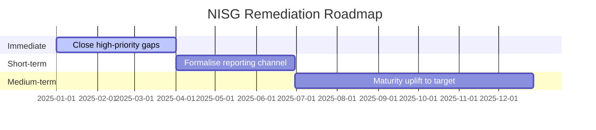

# Austrian NISG (NIS2 Transposition) Assessment

> **Template Origin**: Community | **ArcKit Version**: [VERSION] | **Command**: `/arckit:at-nisg`
>
> ⚠️ **Community-contributed** — not yet validated against current BMI / A-SIT / EU regulatory text. Verify all citations before relying on output. The NISG NIS2 amendment (BGBl. I Nr. 94/2025) is recent; items marked `[NEEDS VERIFICATION]` must be confirmed against current text and implementing ordinances.

## Document Control

<!-- DOC-CONTROL-HEADER -->
<!-- Resolved at command-execution time to _partials/document-control-uk.md or _partials/document-control-uae.md based on plugin userConfig classification_scheme + governance_framework. See _partials/RENDERING.md (when present). -->

## Revision History

| Version | Date | Author | Changes | Approved By | Approval Date |
|---------|------|--------|---------|-------------|---------------|
| [VERSION] | [YYYY-MM-DD] | ArcKit AI | Initial creation from `/arckit:at-nisg` | [PENDING] | [PENDING] |

## Executive Summary

| Pillar | Status | Critical Gaps |
|--------|--------|--------------|
| Austrian Scoping | [Essential / Important / Out of scope] | [Count] |
| Governance | [Compliant / Partial / Gap] | [Count] |
| Risk Management | [Compliant / Partial / Gap] | [Count] |
| Incident Reporting (GovCERT) | [Compliant / Partial / Gap] | [Count] |
| Supply Chain | [Compliant / Partial / Gap] | [Count] |
| Business Continuity | [Compliant / Partial / Gap] | [Count] |

---

## 1. Austrian Scope and Designation

### 1.1 Sector Classification

| NIS2 Annex | Sector / Sub-sector | Applicable | AT Competent Authority |
|------------|---------------------|-----------|------------------------------------------------|
| I | Energy (Electricity) | ☐ | E-Control |
| I | Energy (Gas / Oil / Hydrogen) | ☐ | E-Control |
| I | Transport (Air / Rail / Water / Road) | ☐ | BMK |
| I | Banking / Financial Market | ☐ | FMA / OeNB |
| I | Health | ☐ | BMSGPK / ELGA |
| I | Drinking Water / Wastewater | ☐ | BMK / Land authorities |
| I | Digital Infrastructure / ICT | ☐ | BMI / RTR |
| I | Public Administration | ☐ | BMI (federal) / Land |
| I | Space | ☐ | BMK |
| II | Postal / Courier / Waste / Chemicals / Food | ☐ | Sectoral |
| II | Manufacturing / Digital providers / Research | ☐ | Sectoral |

### 1.2 Designation

| Item | Value |
|------|-------|
| Entity Designation | [Essential / Important / Out of scope] |
| Previous NISG 2018 status | [Betreiber wesentlicher Dienste / None] |
| Main establishment | [AT / other EU MS] |
| Cross-border operations | [List MS] |
| Size threshold result | [≥250 emp / 50–250 / <50 / micro] |

---

## 2. Governance (NIS2 Art. 20 — as transposed)

| Obligation | Status | Evidence / Gap |
|-----------|--------|----------------|
| Geschäftsleitung approves security measures | [Yes / Partial / No] | |
| Management body personally liable acknowledged (NIS2 Art. 20, NISG § transposed) | [Yes / Partial / No] | |
| Management body cyber training completed | [Yes / Partial / No] | |
| Responsibility mapped (CISO / Sicherheitsbeauftragter) | [Yes / Partial / No] | |

---

## 3. Risk Management Measures (NIS2 Art. 21 — as transposed)

| # | Measure | Status | Gap | Proportionality Note |
|---|---------|--------|-----|----------------------|
| 1 | Risk analysis policy | | | |
| 2 | Incident handling | | | |
| 3 | Business continuity / BCM | | | |
| 4 | Supply chain security | | | |
| 5 | Secure acquisition / development / maintenance | | | |
| 6 | Policies to assess effectiveness | | | |
| 7 | Cyber hygiene + training | | | |
| 8 | Cryptography policy | | | |
| 9 | HR security + access control | | | |
| 10 | MFA + secure communications | | | |

A-SIT guidance alignment (sector-agnostic security guidance, commonly referenced by BMI/sectoral authorities): [Summary]

---

## 4. Incident Reporting — Austrian Channel

| Item | Status | Evidence / Gap |
|------|--------|----------------|
| Three-tier CERT reporting established: Sectoral CERT → CERT.at (BMI §5) → GovCERT (BKA §4(4), public-admin only) | | |
| Correct reporting channel identified (non-public → CERT.at; public-admin → GovCERT) | | |
| Sectoral CERT contact (if applicable) | | |
| 24-hour early warning capability | | |
| 72-hour notification capability | | |
| Intermediate / final report process | | |
| Cross-reporting to DSB for personal data breach | | |
| Reporting language / form readiness (German, AT form) | | |
| Tabletop exercise in last 12 months | | |

---

## 5. Supply Chain Security

| Control | Status | Evidence / Gap |
|---------|--------|----------------|
| Supplier inventory maintained | | |
| Third-party risk assessment | | |
| Contractual security clauses | | |
| Software supply chain (SBOM / patching) | | |
| ENISA supply chain framework alignment | | |
| Sectoral secondary rules (E-Control Verordnungen / FMA Rundschreiben) | | |
| High-risk vendor treatment (5G / EU toolbox) | | |

---

## 6. Business Continuity and Resilience

| Item | Status | Evidence / Gap |
|------|--------|----------------|
| BCP documented and current | | |
| Backup + restore tested in last 12 months | | |
| Crisis management procedure | | |
| RTO defined | [Value] | |
| RPO defined | [Value] | |
| Alternate site / DR capability | | |

---

## 7. Supervision, Inspections, and Penalties

| Item | Status | Notes |
|------|--------|-------|
| Supervisory posture | [Ex ante (Essential) / Ex post (Important)] | |
| Lead supervisor | [BMI / sectoral] | |
| Maximum penalty | Essential: ≥ €10M / 2% turnover; Important: ≥ €7M / 1.4% turnover (NIS2 Art. 34 floor) | |
| Appeal pathway | BVwG | |
| CISO / Sicherheitsbeauftragter designated | [Yes / No] | |

### 7.1 Qualifizierte Stellen (§18 NISG)

| Item | Status | Notes |
|------|--------|-------|
| Qualifizierte Stelle engaged for audit | [Yes / No / Planned] | BMI-accredited audit body |
| Accreditation confirmed (BMI list) | [Yes / No] | |
| Scope of assessment | [Full / Partial] | |
| Last assessment date | [YYYY-MM-DD / N/A] | |
| Findings remediated | [Yes / Partial / No] | |

---

## 8. KSÖ and National Cyber Coordination

| Item | Status | Notes |
|------|--------|-------|
| KSÖ membership / participation | [Member / Observer / None] | Voluntary |
| NCSC-AT (BKA) / GovCERT (BKA §4(4)) strategic contact | [Yes / No] | |
| CERT.at (BMI §5) operative contact | [Yes / No] | BMI = SPOC + enforcement |
| Information-sharing MoUs | [List] | |

### 8.1 Cyberkrise (§§24-25 NISG)

| Item | Status | Notes |
|------|--------|-------|
| Cyberkrise declaration awareness (BMI declares per §24) | [Yes / No] | |
| Participation in national Cyberkrise exercises (§25) | [Yes / No / Planned] | |
| Communication channel to BMI Cyberkrise-Koordination | [Established / Gap] | |
| Internal escalation to Cyberkrise threshold defined | [Yes / No] | |
| Cross-sector coordination readiness | [Yes / Partial / No] | |

---

## 8b. Austrian NISG Additions Beyond NIS2 Baseline

| Austrian Addition | NISG Reference | NIS2 Equivalent | Compliance Status |
|-------------------|---------------|-----------------|-------------------|
| Qualifizierte Stellen (accredited audit bodies) | §18 | No direct equivalent (Art. 32(2) allows but doesn't mandate) | |
| Cyberkrise framework (national crisis declaration) | §§24-25 | Art. 9(4) crisis mgmt, less prescriptive | |
| GovCERT for public administration (BKA) | §4(4) | Art. 10 CSIRTs (generic) | |
| Land opt-in mechanism | §22(5-6) | No equivalent (federal-only in most MS) | |
| Bundeskanzler designation regardless of size | §3(4) | Art. 2(2)(b-e) similar but EU-level | |
| Sectoral CERT designation by BMI | §14 | Art. 10 CSIRTs (generic) | |
| IKDOK / OpKoord coordination bodies | §7 | Art. 8 competent authorities (generic) | |
| Three-tier CERT escalation (sectoral→national→GovCERT) | §14, §19 | Art. 10-11 (less structured) | |

---

## 9. Gap Analysis and Roadmap

| Domain | Current Maturity | Target | Priority | Owner | Target Date |
|--------|-----------------|--------|----------|-------|-------------|
| Risk analysis | L1–L5 | L1–L5 | 🔴/🟠/🟡 | | |
| Incident handling | L1–L5 | L1–L5 | | | |
| BCM | L1–L5 | L1–L5 | | | |
| Supply chain | L1–L5 | L1–L5 | | | |
| Governance | L1–L5 | L1–L5 | | | |

---

## External References

### Document Register

| DOC_ID | Source | Description |
|--------|--------|-------------|
| | | |

### Citations

| Citation | Used In | Source |
|----------|---------|--------|
| | | |

---

**Generated by**: ArcKit `/arckit:at-nisg` command
**Generated on**: [DATE]
**ArcKit Version**: [VERSION]
**Project**: [PROJECT_NAME]
**Model**: [AI_MODEL]
