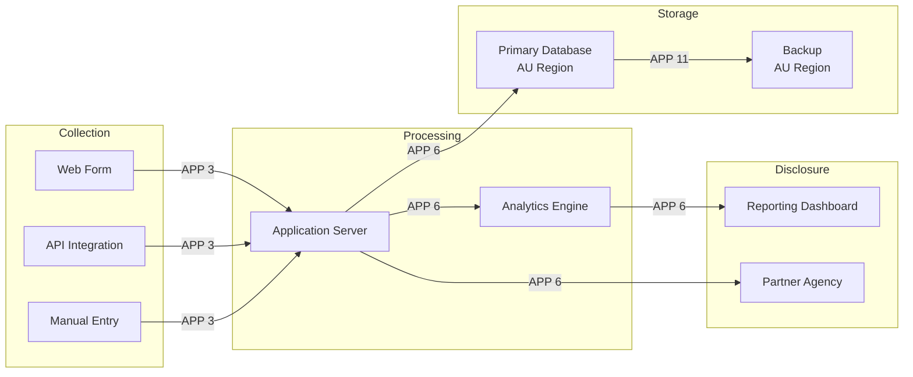

# Privacy Impact Assessment (Privacy Act 1988)

> **Template Origin**: Community | **ArcKit Version**: [VERSION] | **Command**: `/arckit:au-pia`

## Document Control

<!-- DOC-CONTROL-HEADER -->
<!-- Resolved at command-execution time per _partials/RENDERING.md. -->
<!-- Classification line MUST be: -->
<!-- | Classification | UNOFFICIAL / OFFICIAL / OFFICIAL:Sensitive / PROTECTED / SECRET | -->

## Revision History

| Version | Date | Author | Changes | Approved By | Approval Date |
|---------|------|--------|---------|-------------|---------------|
| [VERSION] | [YYYY-MM-DD] | ArcKit AI | Initial creation from `/arckit:au-pia` command | PENDING | PENDING |

---

## Executive Summary

[Two to three paragraphs: project under assessment, personal information involved, overall privacy risk posture, key findings and recommendations.]

---

## Project Description

| Field | Value |
|-------|-------|
| **Project Name** | [Project name] |
| **Owning Agency** | [Department / Agency] |
| **Project Phase** | [Discovery / Alpha / Beta / Live] |
| **Data Subjects** | [Citizens / Employees / Contractors / Business entities] |
| **Personal Information Types** | [Contact details / Identity / Financial / Health / Criminal / Biometric] |
| **Sensitive Information** | [Yes — categories / No] |
| **Estimated Data Volume** | [Number of records / data subjects] |
| **AI/Automated Decisions** | [Yes — describe / No] |
| **Assessment Date** | [YYYY-MM-DD] |
| **Privacy Officer** | [Name and role] |

---

## Information Flows

[Replace with actual information flows for the project. Annotate each flow with the governing APP.]

---

## APP Compliance Assessment

### APP 1 — Open and Transparent Management

| Aspect | Detail |
|--------|--------|
| **Applies** | [Yes / No] |
| **Status** | [✅ Compliant / ⚠️ Partially Compliant / ❌ Non-Compliant] |

**Evidence**: [Privacy policy published, privacy management plan, complaints process, staff training]

**Risk**: [Likelihood] × [Impact] = [Risk Level]

**Mitigation**: [Actions, owners, dates]

---

### APP 2 — Anonymity and Pseudonymity

| Aspect | Detail |
|--------|--------|
| **Applies** | [Yes / No] |
| **Status** | [✅ Compliant / ⚠️ Partially Compliant / ❌ Non-Compliant] |

**Evidence**: [Option to transact anonymously/pseudonymously, exceptions documented]

**Risk**: [Likelihood] × [Impact] = [Risk Level]

**Mitigation**: [Actions, owners, dates]

---

### APP 3 — Collection of Solicited Personal Information

| Aspect | Detail |
|--------|--------|
| **Applies** | [Yes / No] |
| **Status** | [✅ Compliant / ⚠️ Partially Compliant / ❌ Non-Compliant] |

**Evidence**: [Collection limited to necessary information, lawful basis, consent for sensitive information (APP 3.3)]

**Risk**: [Likelihood] × [Impact] = [Risk Level]

**Mitigation**: [Actions, owners, dates]

---

### APP 4 — Dealing with Unsolicited Personal Information

| Aspect | Detail |
|--------|--------|
| **Applies** | [Yes / No] |
| **Status** | [✅ Compliant / ⚠️ Partially Compliant / ❌ Non-Compliant] |

**Evidence**: [Process for unsolicited information — assess, retain or destroy]

**Risk**: [Likelihood] × [Impact] = [Risk Level]

**Mitigation**: [Actions, owners, dates]

---

### APP 5 — Notification of Collection

| Aspect | Detail |
|--------|--------|
| **Applies** | [Yes / No] |
| **Status** | [✅ Compliant / ⚠️ Partially Compliant / ❌ Non-Compliant] |

**Evidence**: [Collection notices, privacy statements at point of collection, matters covered in notice]

**Risk**: [Likelihood] × [Impact] = [Risk Level]

**Mitigation**: [Actions, owners, dates]

---

### APP 6 — Use or Disclosure

| Aspect | Detail |
|--------|--------|
| **Applies** | [Yes / No] |
| **Status** | [✅ Compliant / ⚠️ Partially Compliant / ❌ Non-Compliant] |

**Evidence**: [Use limited to primary purpose, secondary use exceptions documented, disclosure register]

**Risk**: [Likelihood] × [Impact] = [Risk Level]

**Mitigation**: [Actions, owners, dates]

---

### APP 7 — Direct Marketing

| Aspect | Detail |
|--------|--------|
| **Applies** | [Yes / No] |
| **Status** | [✅ Compliant / ⚠️ Partially Compliant / ❌ Non-Compliant / N/A] |

**Evidence**: [Direct marketing controls, opt-out mechanism, consent records]

**Risk**: [Likelihood] × [Impact] = [Risk Level]

**Mitigation**: [Actions, owners, dates]

---

### APP 8 — Cross-Border Disclosure

| Aspect | Detail |
|--------|--------|
| **Applies** | [Yes / No] |
| **Status** | [✅ Compliant / ⚠️ Partially Compliant / ❌ Non-Compliant] |

**Evidence**: [Data residency, cloud hosting regions, offshore processing, reasonable steps to ensure APP compliance by overseas recipient]

**Overseas Recipients**:

| Recipient | Country | Purpose | APP Compliance Mechanism |
|-----------|---------|---------|-------------------------|
| [Name] | [Country] | [Purpose] | [Contract / Consent / Substantially similar laws] |

**Risk**: [Likelihood] × [Impact] = [Risk Level]

**Mitigation**: [Actions, owners, dates]

---

### APP 9 — Government Related Identifiers

| Aspect | Detail |
|--------|--------|
| **Applies** | [Yes / No] |
| **Status** | [✅ Compliant / ⚠️ Partially Compliant / ❌ Non-Compliant] |

**Evidence**: [Government identifiers used (TFN, Medicare, myGovID), adoption restrictions, disclosure controls]

**Risk**: [Likelihood] × [Impact] = [Risk Level]

**Mitigation**: [Actions, owners, dates]

---

### APP 10 — Quality of Personal Information

| Aspect | Detail |
|--------|--------|
| **Applies** | [Yes / No] |
| **Status** | [✅ Compliant / ⚠️ Partially Compliant / ❌ Non-Compliant] |

**Evidence**: [Data quality processes, validation at collection, update mechanisms, accuracy checks]

**Risk**: [Likelihood] × [Impact] = [Risk Level]

**Mitigation**: [Actions, owners, dates]

---

### APP 11 — Security of Personal Information

| Aspect | Detail |
|--------|--------|
| **Applies** | [Yes / No] |
| **Status** | [✅ Compliant / ⚠️ Partially Compliant / ❌ Non-Compliant] |
| **E8 Posture Reference** | [ARC-{P}-AUE8-v{V} if available] |

**Evidence**: [Security controls — encryption, access controls, E8 maturity level, destruction/de-identification procedures]

**Risk**: [Likelihood] × [Impact] = [Risk Level]

**Mitigation**: [Actions, owners, dates]

---

### APP 12 — Access to Personal Information

| Aspect | Detail |
|--------|--------|
| **Applies** | [Yes / No] |
| **Status** | [✅ Compliant / ⚠️ Partially Compliant / ❌ Non-Compliant] |

**Evidence**: [Access request process, response timeframes, FOI integration, exceptions documented]

**Risk**: [Likelihood] × [Impact] = [Risk Level]

**Mitigation**: [Actions, owners, dates]

---

### APP 13 — Correction of Personal Information

| Aspect | Detail |
|--------|--------|
| **Applies** | [Yes / No] |
| **Status** | [✅ Compliant / ⚠️ Partially Compliant / ❌ Non-Compliant] |

**Evidence**: [Correction request process, notification of corrections to third parties]

**Risk**: [Likelihood] × [Impact] = [Risk Level]

**Mitigation**: [Actions, owners, dates]

---

## APP Compliance Summary

| APP | Principle | Applies | Status | Risk Level |
|-----|----------|---------|--------|-----------|
| 1 | Open and transparent management | [Y/N] | [✅/⚠️/❌] | [H/M/L] |
| 2 | Anonymity and pseudonymity | [Y/N] | [✅/⚠️/❌] | [H/M/L] |
| 3 | Collection of solicited information | [Y/N] | [✅/⚠️/❌] | [H/M/L] |
| 4 | Unsolicited personal information | [Y/N] | [✅/⚠️/❌] | [H/M/L] |
| 5 | Notification of collection | [Y/N] | [✅/⚠️/❌] | [H/M/L] |
| 6 | Use or disclosure | [Y/N] | [✅/⚠️/❌] | [H/M/L] |
| 7 | Direct marketing | [Y/N] | [✅/⚠️/❌/N/A] | [H/M/L] |
| 8 | Cross-border disclosure | [Y/N] | [✅/⚠️/❌] | [H/M/L] |
| 9 | Government related identifiers | [Y/N] | [✅/⚠️/❌] | [H/M/L] |
| 10 | Quality of personal information | [Y/N] | [✅/⚠️/❌] | [H/M/L] |
| 11 | Security of personal information | [Y/N] | [✅/⚠️/❌] | [H/M/L] |
| 12 | Access to personal information | [Y/N] | [✅/⚠️/❌] | [H/M/L] |
| 13 | Correction of personal information | [Y/N] | [✅/⚠️/❌] | [H/M/L] |

---

## Privacy Risk Register

| Risk ID | APP | Risk Description | Likelihood | Impact | Risk Level | Mitigation | Residual Risk |
|---------|-----|-----------------|-----------|--------|-----------|-----------|---------------|
| PR-001 | [#] | [Description] | [1-5] | [1-5] | [H/M/L] | [Action] | [H/M/L] |

---

## Sensitive Information Assessment

| Category (Privacy Act s 6) | Processed | Consent Mechanism | Notes |
|---------------------------|-----------|-------------------|-------|
| Racial or ethnic origin | [Y/N] | [Mechanism] | |
| Political opinions | [Y/N] | [Mechanism] | |
| Religious beliefs | [Y/N] | [Mechanism] | |
| Sexual orientation | [Y/N] | [Mechanism] | |
| Criminal record | [Y/N] | [Mechanism] | |
| Health information | [Y/N] | [Mechanism] | |
| Genetic information | [Y/N] | [Mechanism] | |
| Biometric information | [Y/N] | [Mechanism] | |
| Trade union membership | [Y/N] | [Mechanism] | |

---

## AI and Automated Decision-Making

| Aspect | Detail |
|--------|--------|
| **Uses AI/ML** | [Yes / No] |
| **Automated decisions affecting individuals** | [Yes — describe / No] |
| **Individual notification** | [Implemented / Planned for Dec 2026 / Not applicable] |
| **Human review mechanism** | [Describe] |
| **Fairness assessment** | [Completed / In progress / Not started] |
| **AU AI Assurance Reference** | [ARC-{P}-AUAIA-v{V} if available] |

---

## Recommendations

| # | Recommendation | APP | Priority | Owner | Target Date |
|---|---------------|-----|----------|-------|-------------|
| 1 | [Recommendation] | [#] | [Critical/High/Medium/Low] | [Role] | [Date] |

---

## External References

## ArcKit Evidence Integration

| Evidence Area | ArcKit Artefact | How It Supports PIA | Gap / Follow-up |
|---------------|-----------------|---------------------|-----------------|
| Information flows | `/arckit:dfd` / ARC-*-DFD-* | Collection, use, disclosure, cross-border transfer, retention, and disposal flows | [Gap / follow-up] |
| Personal-information inventory | `/arckit:data-model` / ARC-*-DATA-* | APP-relevant entities, sensitive information, identifiers, owners, retention, and access controls | [Gap / follow-up] |
| Privacy risks | `/arckit:risk` / ARC-*-RISK-* | Privacy harms, mitigation ownership, residual risks, and acceptance decisions | [Gap / follow-up] |
| APP traceability | `/arckit:traceability` / ARC-*-TRAC-* | APP obligations mapped to requirements, data entities, controls, and risks | [Gap / follow-up] |
| Coverage view | `/arckit:graph-report` | AUPIA coverage across data-model, risk, traceability, and AU compliance artefacts | [Gap / follow-up] |

### Document Register

| Doc ID | Filename | Type | Source Location | Description |
|--------|----------|------|-----------------|-------------|
| PA88 | Privacy Act 1988 (Cth) | Legislation | legislation.gov.au | Primary privacy legislation |
| OAIC-PIA | OAIC Guide to undertaking PIAs | Guidance | oaic.gov.au | PIA methodology guide |

### Citations

| Citation ID | Doc ID | Page/Section | Category | Quoted Passage |
|-------------|--------|--------------|----------|----------------|
| — | — | — | — | — |

### Unreferenced Documents

| Filename | Source Location | Reason |
|----------|-----------------|--------|
| — | — | — |

---

## Visual Evidence Decision Rule

Generate companion visual artefacts only when the available evidence includes enough structure to identify real nodes and relationships. If evidence is incomplete but structurally useful, create a clearly marked draft visual with `Pending Input` labels. If structural evidence is insufficient, do not create a diagram; record a Visual Evidence Gap and list the minimum inputs needed.

---

**Generated by**: ArcKit `/arckit:au-pia` command
**Generated on**: [DATE]
**ArcKit Version**: [VERSION]
**Project**: [PROJECT_NAME]
**Model**: [AI_MODEL]
