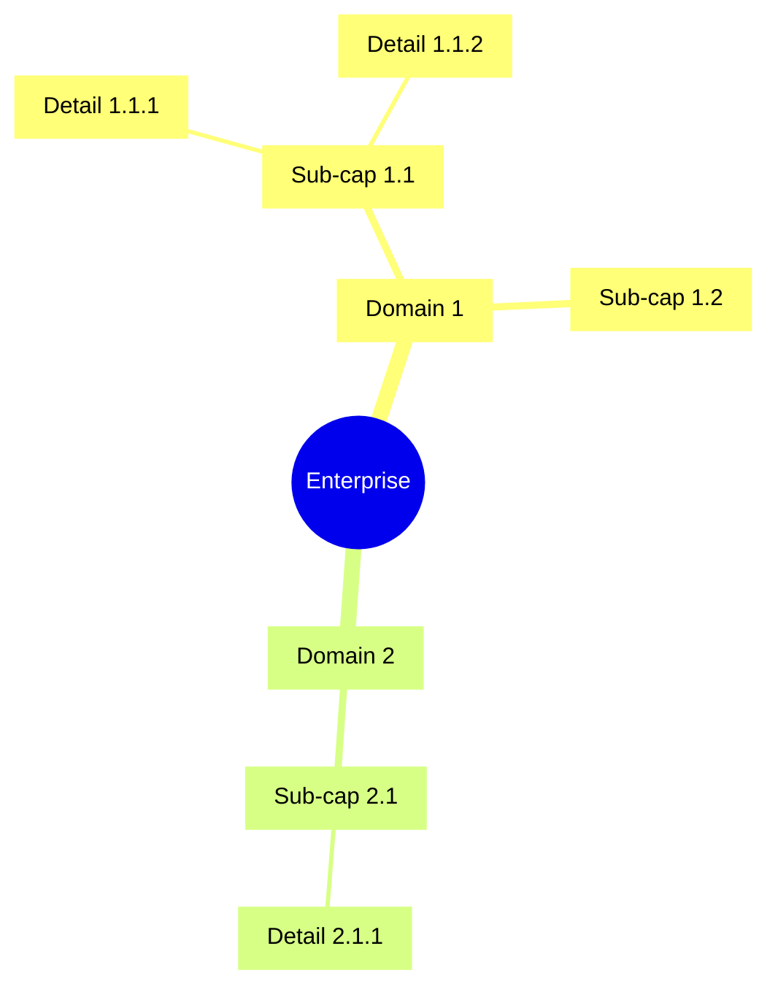

# Business Capability Map

## Document Control

| Field | Value |
|-------|-------|
| Document ID | `ARC-[PROJECT_ID]-BPCM-v[VERSION]` |
| Project | `[PROJECT_NAME]` |
| Owner | `[OWNER_NAME_AND_ROLE]` |
| Classification | `[CLASSIFICATION]` |
| Status | DRAFT |
| Created | `[YYYY-MM-DD]` |
| Review Date | `[YYYY-MM-DD]` |

### Revision History

| Version | Date | Author | Description | Reviewer | Approver |
|---------|------|--------|-------------|----------|----------|
| `[VERSION]` | `[YYYY-MM-DD]` | ArcKit AI | Initial creation | `[REVIEWER_NAME]` | `[APPROVER_NAME]` |

---

## 1. Capability Hierarchy

### Level 1: Capability Domains

| Domain ID | Domain | Description |
|-----------|--------|-------------|
| C1.0 | [Domain] | [Description] |

### Level 2: Sub-Capabilities

[For each domain, list sub-capabilities]

### Level 3: Detailed Capabilities

[For each sub-capability, list detailed capabilities]

### Capability Map (Mermaid mindmap)



## 2. Value Streams

### Value Stream Matrix

| Value Stream | Capabilities | Trigger | Outcome |
|--------------|--------------|---------|---------|
| [VS-001] | [C1.1, C2.3, C3.1] | [Trigger] | [Outcome] |

### Value Stream Flow


## 3. Capability Maturity Assessment

| Capability | Current (L1-L5) | Target (L1-L5) | Gap | Priority |
|------------|----------------|---------------|-----|----------|
| [C1.1.1] | [L2] | [L4] | [Gap] | [High/Med/Low] |

## 4. Capability Heatmap

```mermaid
quadrantChart
    title Strategic Importance vs Maturity
    x-axis__Low --> High
    y-axis__Low --> High
    quadrant-1 Invest
    quadrant-2 Maintain
    quadrant-3 Monitor
    quadrant-4 Transform
    "C1.1.1": 0.8, 0.3
    "C2.1.1": 0.3, 0.8
```

## 5. Capability-Requirement Traceability

| Requirement | Capability | Coverage |
|-------------|------------|----------|
| BR-001 | [C1.1.1] | [Full/Partial/Gap] |

## 6. Capability-Principle Alignment

| Principle | Related Capabilities | Alignment |
|-----------|---------------------|-----------|
| [PRIN-01] | [C1.1.1, C1.2.1] | [Aligned/Partial] |

## 7. Traceability

| Source | Artifact | Link |
|--------|----------|------|
| ADM Preliminary | `ARC-[P]-ADMP-v[N].md` | [Direct] |
| Requirements | `ARC-[P]-REQ-v[N].md` | [Direct] |
| Stakeholders | `ARC-[P]-STKE-v[N].md` | [Direct] |
| Principles | `ARC-000-PRIN-v[N].md` | [Direct] |

---

**Generated by**: ArcKit `/arckit:business-capability-map` command
**Generated on**: `[DATE] [TIME] GMT`
**ArcKit Version**: `{ARCKIT_VERSION}`
**Project**: `[PROJECT_NAME]` (Project `[PROJECT_ID]`)
