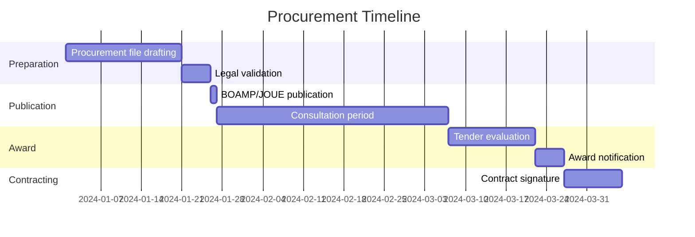

# French Public Procurement File (Dossier de Consultation)

> **Template Origin**: Community | **ArcKit Version**: [VERSION] | **Command**: `/arckit:fr-marche-public`
>
> ⚠️ **Community-contributed** — not yet validated against current ANSSI/CNIL/EU regulatory text. Verify all citations before relying on output.

## Document Control

<!-- DOC-CONTROL-HEADER -->
<!-- Resolved at command-execution time to _partials/document-control-uk.md or _partials/document-control-uae.md based on plugin userConfig classification_scheme + governance_framework. See _partials/RENDERING.md (when present). -->

## Revision History

| Version | Date | Author | Changes | Approved By | Approval Date |
|---------|------|--------|---------|-------------|---------------|
| [VERSION] | [YYYY-MM-DD] | ArcKit AI | Initial creation from `/arckit:fr-marche-public` | [PENDING] | [PENDING] |

---

## 1. Threshold Analysis and Recommended Procedure

| Parameter | Value |
|-----------|-------|
| Estimated total value (excl. VAT) | [Amount] |
| Applicable threshold | [< €40k / < €215k / > €215k] |
| Recommended procedure | [Below-threshold negotiated (MAPA) / Open tender / Restricted] |
| Publication on BOAMP | [Yes / No] |
| Publication on JOUE (EU Official Journal) | [Yes / No] |
| Minimum consultation period | [X days] |

### 1.1 State Cloud Doctrine (Doctrine cloud de l'État)

[Complete if cloud services are involved — Circular 6264/SG of 5 July 2021]

- [ ] Internal government cloud (cloud de l'État) evaluated
- [ ] Trusted commercial cloud (SecNumCloud-qualified offer) evaluated
- [ ] Justification for chosen option documented

## 2. Requirements Statement

### 2.1 Subject of the Contract

[Concise description of the goods or services to be procured]

### 2.2 Functional Requirements (from /arckit:requirements)

[Extract FR-xxx requirements relevant to procurement scope]

### 2.3 Technical Requirements

| Requirement | Priority | Verification criterion |
|-------------|----------|----------------------|
| [NFR-xxx] [Description] | Mandatory / Desirable | [How verified] |

### 2.4 Sovereignty and Security Requirements

| Requirement | Reference framework | Mandatory |
|-------------|--------------------|----|
| Data hosting in France / EU | State Cloud Doctrine | Yes |
| SecNumCloud qualification (if sensitive data) | ANSSI | Depends on classification |
| HDS certification (if health data) | ANS | Yes |
| RGS v2.0 compliance | ANSSI | Yes |
| RGI v2.0 compliance (interoperability) | DINUM | Yes |
| RGAA 4.1 accessibility | DINUM | Yes (public digital services) |
| RGESN ecodesign | DINUM | Recommended |

## 3. Award Criteria

### 3.1 Weighting

| Criterion | Weighting | Sub-criteria |
|-----------|-----------|-------------|
| Technical value | 60% | Functional fit (25%), Technical architecture (20%), Security/sovereignty (15%) |
| Price | 30% | Total cost of ownership over [X] years |
| Execution conditions | 10% | Timelines, reversibility, support |

> Total must equal 100%. Adjust sub-criteria to match project priorities.

### 3.2 Technical Scoring Grid

| Sub-criterion | Score 0 | Score 1 | Score 2 | Score 3 |
|--------------|---------|---------|---------|---------|
| Functional fit | No coverage | Partial | Substantial | Full coverage |
| Security/sovereignty | No compliance | Partial | Substantial | Full SecNumCloud/RGS |

## 4. Security and Sovereignty Clauses

### 4.1 Security Annex (mandatory)

The services must comply with:

- RGS v2.0 (security accreditation of the information system before go-live)
- State Information Systems Security Policy (PSSIE)
- ANSSI IT hygiene guide (42 measures)
- [If OIV/OSE] Applicable sector-specific orders under LPM/NIS

### 4.2 Data Localisation Clause

All data processed under this contract must be hosted and processed exclusively within the territory of the European Union. The contractor must guarantee that no extra-European law (Cloud Act, FISA, etc.) can allow access to the data without prior agreement from the French authorities.

### 4.3 Reversibility Clause

In accordance with the DINUM reversibility circular:

- Reversibility plan provided before project start
- Data export in open formats (RGI-compliant)
- Migration period: [X] months
- Exit costs: included in contract price

### 4.4 Open Source Clause

[If applicable per State Cloud Doctrine Point 3]
Specific developments carried out under this contract must be published as open source under [MIT / EUPL] licence unless otherwise justified.

### 4.5 GDPR / Data Processing Agreement

The contractor must provide a Data Processing Agreement (DPA) compliant with GDPR Article 28 covering:

- Processing purposes and data categories
- Sub-processor authorisation and list
- Security measures (Article 32)
- Data subject rights assistance
- Return/deletion of data on contract end

## 5. UGAP Catalogue — Available Framework Agreements

[Check current catalogue at ugap.fr before finalising — framework agreements are updated regularly]

| Category | UGAP Framework | Relevant lot | Listed providers |
|----------|---------------|-------------|-----------------|
| Sovereign cloud IaaS | [UGAP ref] | [Lot] | Outscale, OVHcloud, NumSpot |
| Application development | [UGAP ref] | [Lot] | [Listed IT service firms] |
| Cybersecurity services | [UGAP ref] | [Lot] | [PRIS-qualified providers] |
| Managed services | [UGAP ref] | [Lot] | [Providers] |

## 6. Indicative Timeline

## 7. Digital State Doctrine Compliance

### 7.1 DINUM Checklist

- [ ] Cloud-first policy applied (Circular 6264/SG)
- [ ] RGI v2.0 interoperability — open formats specified
- [ ] RGAA 4.1 accessibility — mandatory clause included for public services
- [ ] RGESN ecodesign — criteria included
- [ ] Open source — publication policy defined
- [ ] Personal data — DPA/GDPR required from contractor

### 7.2 PSSIE and RGS

- Target security level: [RGS * / ** / ***]
- Security accreditation planned before go-live: [Yes / No]
- Accreditation authority: [Name / role]

---

**Generated by**: ArcKit `/arckit:fr-marche-public` command
**Generated on**: [YYYY-MM-DD]
**ArcKit Version**: [VERSION]
**Project**: [PROJECT_NAME]
**Model**: [AI_MODEL]
