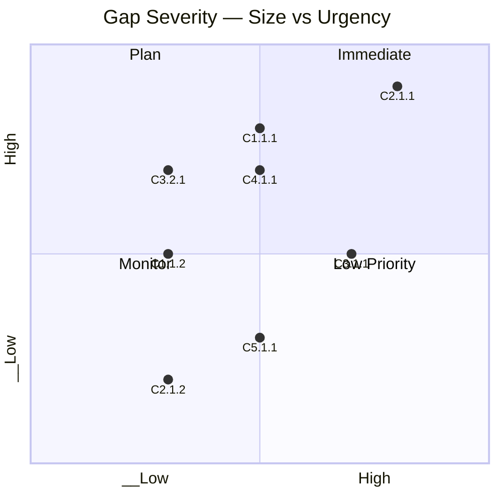

# Gap Analysis

## Document Control

| Field | Value |
|-------|-------|
| Document ID | `ARC-[PROJECT_ID]-GAPA-v[VERSION]` |
| Project | `[PROJECT_NAME]` |
| Owner | `[OWNER_NAME_AND_ROLE]` |
| Classification | `[CLASSIFICATION]` |
| Status | DRAFT |
| Severity Weighting | `[BALANCED / STRATEGIC-RISK / OPERATIONAL]` |
| Created | `[YYYY-MM-DD]` |
| Review Date | `[YYYY-MM-DD]` |

### Revision History

| Version | Date | Author | Description | Reviewer | Approver |
|---------|------|--------|-------------|----------|----------|
| `[VERSION]` | `[YYYY-MM-DD]` | ArcKit AI | Initial creation from `/arckit:gap-analysis` command | `[REVIEWER_NAME]` | `[APPROVER_NAME]` |

---

## 1. Capability Gap Matrix

| Capability | Current | Target | Gap Size | Urgency | Severity (Size×Urgency) | Workstream |
|------------|---------|--------|----------|---------|--------------------------|------------|
| C1.1.1: [Capability Name] | L2 | L4 | Medium | High | High | WS-001 |
| C1.1.2: [Capability Name] | L3 | L4 | Small | Medium | Medium | WS-001 |
| C2.1.1: [Capability Name] | L1 | L4 | Large | High | Critical | WS-002 |
| C2.1.2: [Capability Name] | L2 | L3 | Small | Low | Low | WS-003 |
| C3.1.1: [Capability Name] | L3 | L5 | Large | Medium | High | WS-002 |
| C3.2.1: [Capability Name] | L4 | L5 | Small | High | Medium | WS-003 |
| C4.1.1: [Capability Name] | L1 | L3 | Medium | High | High | WS-001 |
| C4.2.1: [Capability Name] | L2 | L2 | None | Low | Informational | — |
| C5.1.1: [Capability Name] | L3 | L5 | Medium | Low | Medium | WS-004 |

### Gap Size Classification

| Gap Size | Maturity Delta | Description |
|----------|---------------|-------------|
| Small | Δ = 1 level | Incremental improvement |
| Medium | Δ = 2 levels | Significant enhancement required |
| Large | Δ ≥ 3 levels | Fundamental transformation required |

### Urgency Classification

| Urgency | Description | Timeframe |
|---------|-------------|-----------|
| High | Must address in immediate planning horizon | 0–3 months |
| Medium | Address in next delivery cycle | 3–12 months |
| Low | Plan for future cycles | 12–24 months |

### Severity Matrix

| | Urgency: Low | Urgency: Medium | Urgency: High |
|---|---|---|---|
| **Gap Size: Small** | Informational | Medium | Medium |
| **Gap Size: Medium** | Low | Medium | High |
| **Gap Size: Large** | Plan | High | Critical |

---

## 2. Gap Heatmap



### Heatmap Interpretation

| Quadrant | Count | Action |
|----------|-------|--------|
| **Immediate** (Large + High urgency) | [N] | Assign to next work package |
| **Plan** (Large + Low urgency) | [N] | Include in 12-month planning |
| **Monitor** (Small + High urgency) | [N] | Quick wins — address early |
| **Low Priority** (Small + Low urgency) | [N] | Maintain in backlog |

---

## 3. Workstream Mapping

| Workstream ID | Name | Gaps | Dependencies | Duration | Resources |
|---------------|------|------|-------------|----------|-----------|
| WS-001 | [Workstream Name] | [C1.1.1, C4.1.1] | [—] | [6 months] | [5 FTE] |
| WS-002 | [Workstream Name] | [C2.1.1, C3.1.1] | [WS-001] | [9 months] | [8 FTE] |
| WS-003 | [Workstream Name] | [C2.1.2, C3.2.1] | [WS-002] | [4 months] | [3 FTE] |
| WS-004 | [Workstream Name] | [C5.1.1] | [WS-002] | [3 months] | [2 FTE] |

### Workstream Dependencies

```mermaid
flowchart TD
    WS1[WS-001: [Workstream 1 Name]] --> WS2[WS-002: [Workstream 2 Name]]
    WS2 --> WS3[WS-003: [Workstream 3 Name]]
    WS1 --> WS3
    WS2 --> WS4[WS-004: [Workstream 4 Name]]
```

### Workstream Details

#### WS-001: [Workstream Name]

- **Objective**: [Brief description of what this workstream delivers]
- **Gaps addressed**: [List capabilities]
- **Key activities**:
  1. [Activity 1]
  2. [Activity 2]
  3. [Activity 3]
- **Success criteria**: [Measurable outcomes]

#### WS-002: [Workstream Name]

- **Objective**: [Brief description of what this workstream delivers]
- **Gaps addressed**: [List capabilities]
- **Key activities**:
  1. [Activity 1]
  2. [Activity 2]
  3. [Activity 3]
- **Success criteria**: [Measurable outcomes]

---

## 4. Gap-to-Risk Mapping

| Gap | Capability | Associated Risk | Risk Category | Impact | Mitigation |
|-----|-----------|-----------------|---------------|--------|----------|
| G-001 | C1.1.1 | [Risk description] | [Operational/Strategic/Compliance] | [High/Medium/Low] | [Mitigation] |
| G-002 | C2.1.1 | [Risk description] | [Operational/Strategic/Compliance] | [High/Medium/Low] | [Mitigation] |
| G-003 | C3.1.1 | [Risk description] | [Operational/Strategic/Compliance] | [High/Medium/Low] | [Mitigation] |
| G-004 | C4.1.1 | [Risk description] | [Operational/Strategic/Compliance] | [High/Medium/Low] | [Mitigation] |
| G-005 | C5.1.1 | [Risk description] | [Operational/Strategic/Compliance] | [High/Medium/Low] | [Mitigation] |

---

## 5. Assumptions & Constraints

### Assumptions

1. [Assumption about current state assessment accuracy]
2. [Assumption about target state feasibility]
3. [Assumption about resource availability]
4. [Assumption about technology stability]

### Constraints

1. **Budget**: [Budget constraints affecting gap closure]
2. **Timeline**: [Time-based constraints on delivery]
3. **Skills**: [Skills gaps that affect workstream execution]
4. **Technology**: [Technology constraints and dependencies]
5. **Compliance**: [Regulatory constraints on approach]

---

## 6. Traceability

| Gap | Source Capability (BPCM) | Target State (STRAT) | Principle Alignment (PRIN) | Workstream |
|-----|--------------------------|---------------------|-------------------------------|------------|
| G-001 | C1.1.1 (L2 → L4) | STRAT Section 3.2 | PRIN-005 | WS-001 |
| G-002 | C2.1.1 (L1 → L4) | STRAT Section 4.1 | PRIN-003 | WS-002 |
| G-003 | C3.1.1 (L3 → L5) | STRAT Section 2.5 | PRIN-007 | WS-002 |
| G-004 | C4.1.1 (L1 → L3) | STRAT Section 5.3 | PRIN-002 | WS-001 |
| G-005 | C5.1.1 (L3 → L5) | STRAT Section 3.8 | PRIN-009 | WS-004 |

### External References

| ID | Source | Relevance |
|----|--------|-----------|
| [GA-E1] | [External document name] | [What it contributed] |

---

**Generated by**: ArcKit `/arckit:gap-analysis` command
**Generated on**: `[DATE] [TIME] GMT`
**ArcKit Version**: `{ARCKIT_VERSION}`
**Project**: `[PROJECT_NAME]` (Project `[PROJECT_ID]`)
**Severity Weighting Profile**: `[BALANCED / STRATEGIC-RISK / OPERATIONAL]`
