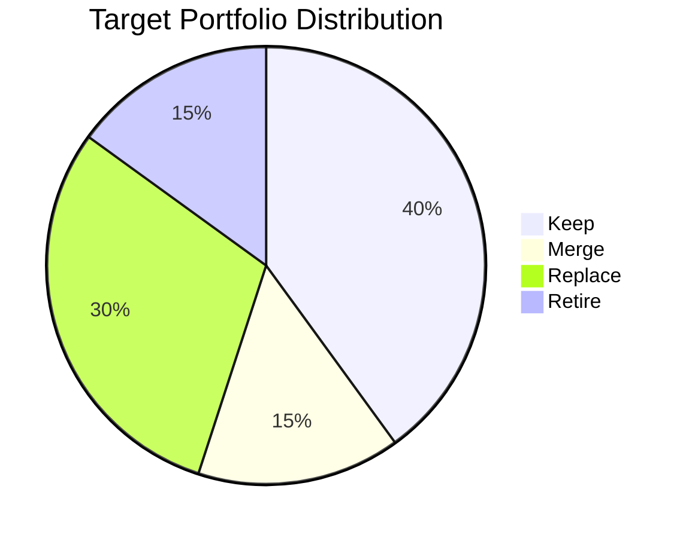
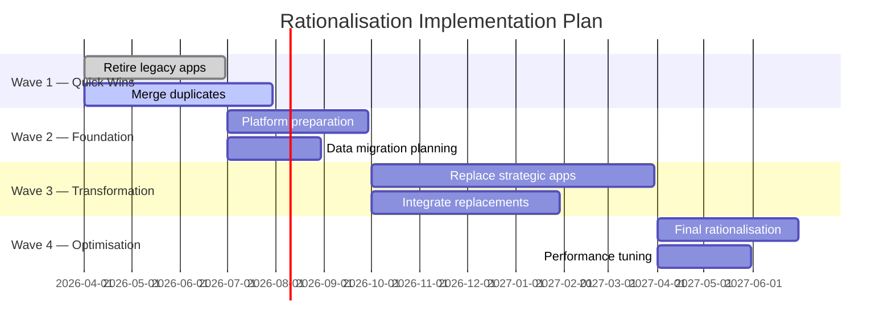

# Application Rationalisation

## Document Control

| Field | Value |
|-------|-------|
| Document ID | `ARC-[PROJECT_ID]-APPR-v[VERSION]` |
| Document Type | Application Rationalisation |
| Project | `[PROJECT_NAME]` |
| Classification | `[CLASSIFICATION]` |
| Status | DRAFT |
| Version | `[VERSION]` |
| Created | `[YYYY-MM-DD]` |
| Last Modified | `[YYYY-MM-DD]` |
| Review Cycle | Quarterly during active rationalisation programme |
| Next Review Date | `[YYYY-MM-DD]` |
| Owner | `[OWNER_NAME_AND_ROLE]` |
| Reviewed By | `[REVIEWER_NAME]` |
| Approved By | `[APPROVER_NAME]` |
| Distribution | `[DISTRIBUTION_LIST]` |

### Revision History

| Version | Date | Author | Description | Reviewer | Approver |
|---------|------|--------|-------------|----------|----------|
| `[VERSION]` | `[YYYY-MM-DD]` | ArcKit AI | Initial creation from `/arckit:application-rationalization` command | `[REVIEWER_NAME]` | `[APPROVER_NAME]` |

---

## 1. Rationalisation Summary

| Decision | Count | Applications |
|----------|-------|-------------|
| Keep | [N] | [App-1, App-2, ...] |
| Merge | [N] | [App-3, App-4 (→ target), ...] |
| Replace | [N] | [App-5, App-6, ...] |
| Retire | [N] | [App-7, App-8, ...] |

**Overall Portfolio**: [N] applications assessed → [N] decisions rendered
**Target reduction**: [X]% fewer applications post-rationalisation

## 2. Per-Application Decisions

### APP-001: [Application Name] — [KEEP / MERGE / REPLACE / RETIRE]

- **Capability**: [Primary capability served]
- **Strategic Fit**: [Strategic / Critical / Support]
- **Technical Condition**: [Modern / Aging / Legacy]
- **Business Value**: [High / Medium / Low]
- **Current Cost**: [£X/year — license, maintenance, infrastructure, FTE]
- **Rationale**: [Why this decision — reference principles, strategy, BPCM alignment]
- **Migration Approach**: [Lift-shift / Replatform / Refactor / Retire / Consolidate]
- **Target Platform** (if Replace/Merge): [Platform name]
- **Timeline**: [Q1 2026 / Wave 1, etc.]
- **Estimated Cost**: [£X]
- **Risk Level**: [Low / Medium / High]
- **Dependencies**: [Upstream/downstream applications affected]
- **Owner**: [Application owner / business sponsor]

### APP-002: [Application Name] — [KEEP / MERGE / REPLACE / RETIRE]

- **Capability**: [Primary capability served]
- **Strategic Fit**: [Strategic / Critical / Support]
- **Technical Condition**: [Modern / Aging / Legacy]
- **Business Value**: [High / Medium / Low]
- **Current Cost**: [£X/year — license, maintenance, infrastructure, FTE]
- **Rationale**: [Why this decision]
- **Migration Approach**: [Lift-shift / Replatform / Refactor / Retire / Consolidate]
- **Target Platform** (if Replace/Merge): [Platform name]
- **Timeline**: [Q1 2026 / Wave 1, etc.]
- **Estimated Cost**: [£X]
- **Risk Level**: [Low / Medium / High]
- **Dependencies**: [Upstream/downstream applications affected]
- **Owner**: [Application owner / business sponsor]

### APP-003: [Application Name] — [KEEP / MERGE / REPLACE / RETIRE]

- **Capability**: [Primary capability served]
- **Strategic Fit**: [Strategic / Critical / Support]
- **Technical Condition**: [Modern / Aging / Legacy]
- **Business Value**: [High / Medium / Low]
- **Current Cost**: [£X/year — license, maintenance, infrastructure, FTE]
- **Rationale**: [Why this decision]
- **Migration Approach**: [Lift-shift / Replatform / Refactor / Retire / Consolidate]
- **Target Platform** (if Replace/Merge): [Platform name]
- **Timeline**: [Q1 2026 / Wave 1, etc.]
- **Estimated Cost**: [£X]
- **Risk Level**: [Low / Medium / High]
- **Dependencies**: [Upstream/downstream applications affected]
- **Owner**: [Application owner / business sponsor]

[Continue for each application in inventory...]

## 3. Portfolio Target State

### Target Distribution

| Decision Category | Count | Percentage |
|-------------------|-------|------------|
| Keep | [N] | [X]% |
| Merge | [N] | [X]% |
| Replace | [N] | [X]% |
| Retire | [N] | [X]% |
| **Total** | **[N]** | **100%** |

### Capability Coverage

| Capability | Current Apps | Target Apps | Decision |
|------------|-------------|------------|----------|
| [Capability A] | [N] | [N] | [Consolidated] |
| [Capability B] | [N] | [N] | [Unchanged] |
| [Capability C] | [N] | [N] | [New replacement needed] |

## 4. Consolidation Benefits

| Benefit Area | Estimated Value | Confidence | Notes |
|--------------|-----------------|------------|-------|
| License reduction | £[X]/year | [High/Med/Low] | [Detail] |
| Maintenance savings | £[X]/year | [High/Med/Low] | [Detail] |
| Operational efficiency | [X]% reduction | [High/Med/Low] | [Detail] |
| Infrastructure consolidation | £[X]/year | [High/Med/Low] | [Detail] |
| Security posture improvement | [Qualitative] | [High/Med/Low] | [Detail] |
| **Total estimated annual benefit** | **£[X]/year** | — | — |

**Return on Investment**: [X] months to realise savings vs. total rationalisation investment of £[X]

## 5. Risk Register

| # | Risk | Affected App(s) | Likelihood | Impact | Mitigation |
|---|------|-----------------|-----------|--------|------------|
| 1 | [Business disruption during migration] | [APP-XXX] | [Low/Med/High] | [Low/Med/High] | [Mitigation plan] |
| 2 | [Data loss during consolidation] | [APP-XXX] | [Low/Med/High] | [Low/Med/High] | [Mitigation plan] |
| 3 | [Integration dependency breakdown] | [APP-XXX] | [Low/Med/High] | [Low/Med/High] | [Mitigation plan] |
| 4 | [Vendor non-cooperation on contract termination] | [APP-XXX] | [Low/Med/High] | [Low/Med/High] | [Mitigation plan] |
| 5 | [Staff skills gap for new platform] | [APP-XXX] | [Low/Med/High] | [Low/Med/High] | [Mitigation plan] |

## 6. Implementation Sequencing

### Wave Details

| Wave | Focus | Duration | Apps | Key Milestone |
|------|-------|----------|------|---------------|
| 1 — Quick Wins | Low-risk retirements and clear merges | [N] months | [N] apps | [Milestone] |
| 2 — Foundation | Platform readiness and data prep | [N] months | [N] apps | [Milestone] |
| 3 — Transformation | Major replacements and migrations | [N] months | [N] apps | [Milestone] |
| 4 — Optimisation | Final rationalisation and tuning | [N] months | [N] apps | [Milestone] |

## 7. Traceability

| Source Artifact | Document | Link/Reference |
|-----------------|----------|----------------|
| Application Portfolio | `ARC-[P]-APP-v[N].md` | [Direct reference] |
| Business Capability Model | `ARC-[P]-BPCM-v[N].md` | [Capability alignment] |
| Architecture Principles | `ARC-000-PRIN-v[N].md` | [Principle references] |
| Architecture Decisions | `ARC-[P]-ADR-*.md` | [Decision references] |

## 8. Assumptions

1. [Application inventory is complete and up to date]
2. [Business sponsors will approve decisions within 30 days]
3. [Budget envelope of £[X] available for rationalisation programme]

## 9. Decisions Pending Approval

| Decision | App | Status | Required By |
|----------|-----|--------|------------|
| [Pending decision] | [APP-XXX] | Awaiting sponsor approval | [YYYY-MM-DD] |

---

**Generated by**: ArcKit `/arckit:application-rationalization` command
**Generated on**: `[DATE] [TIME] GMT`
**ArcKit Version**: `{ARCKIT_VERSION}`
**Project**: `[PROJECT_NAME]` (Project `[PROJECT_ID]`)
**AI Model**: `[MODEL_NAME]`
**Generation Context**: [Brief note about source documents used]
