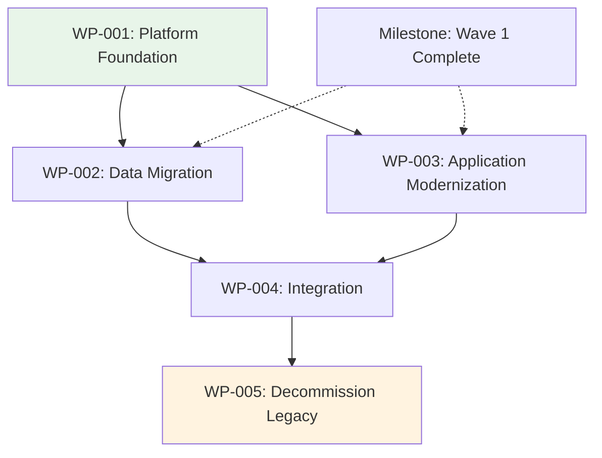

# Transition Architecture

## Document Control

| Field | Value |
|-------|-------|
| Document ID | `ARC-[PROJECT_ID]-TRANS-v[VERSION]` |
| Document Type | Transition Architecture |
| Project | `[PROJECT_NAME]` |
| Classification | `[CLASSIFICATION]` |
| Status | DRAFT |
| Version | `[VERSION]` |
| Created | `[YYYY-MM-DD]` |
| Last Modified | `[YYYY-MM-DD]` |
| Review Cycle | Monthly during active migration, quarterly after migration |
| Next Review Date | `[YYYY-MM-DD]` |
| Owner | `[OWNER_NAME_AND_ROLE]` |
| Reviewed By | `[REVIEWER_NAME]` |
| Approved By | `[APPROVER_NAME]` |
| Distribution | `[DISTRIBUTION_LIST]` |

### Revision History

| Version | Date | Author | Description | Reviewer | Approver |
|---------|------|--------|-------------|----------|----------|
| `[VERSION]` | `[YYYY-MM-DD]` | ArcKit AI | Initial creation from `/arckit:transition-architecture` command | `[REVIEWER_NAME]` | `[APPROVER_NAME]` |

---

## 1. Transition Overview

| Architecture | Scope | Duration | Investment |
|--------------|-------|----------|------------|
| Architecture 1 (Baseline) | Current state — [brief description] | — | — |
| Architecture 2 | [Wave 1 scope — key capabilities achieved] | [6 months] | [£X] |
| Architecture 3 | [Wave 2 scope — key capabilities achieved] | [6 months] | [£X] |
| Target Architecture | Final state — [brief description] | — | — |

### Transition Waves

**Wave 1 — [Wave Name]** (Architecture 2)

- **Objective**: [Brief objective of the wave]
- **Duration**: [Start] to [End] ([N] months)
- **Key Deliverables**:
  - [Deliverable 1]
  - [Deliverable 2]
  - [Deliverable 3]
- **Governance Gate**: [Gate name — e.g., "Wave 1 Complete — ARB review"]

**Wave 2 — [Wave Name]** (Architecture 3)

- **Objective**: [Brief objective of the wave]
- **Duration**: [Start] to [End] ([N] months)
- **Key Deliverables**:
  - [Deliverable 1]
  - [Deliverable 2]
  - [Deliverable 3]
- **Governance Gate**: [Gate name — e.g., "Wave 2 Complete — Steering Committee review"]

---

## 2. Work Packages

### WP-001: [Work Package Name]

- **Wave**: [Wave 1 / Architecture 2]
- **Scope**: [What this work package delivers — 2-3 sentence description]
- **Deliverables**:
  - [Deliverable 1 — concrete, artefact-level output]
  - [Deliverable 2]
  - [Deliverable 3]
- **Dependencies**: [WP-002 (must complete), ADR-001 (technology decision)]
- **Resources**: [X FTE across roles, £Y budget]
- **Timeline**: [Start date] → [End date] ([N] months)
- **GAPA Gaps addressed**: [G-001, G-003, G-005]
- **Acceptance Criteria**:
  - [Criterion 1 — measurable and testable, e.g., "API platform handles >= 10,000 concurrent requests with < 200ms latency at 95th percentile"]
  - [Criterion 2 — e.g., "All critical data migrated with < 0.01% loss rate verified by reconciliation"]
  - [Criterion 3 — e.g., "Security baseline meets NCSC CAF Level 3 requirements"]
  - [Criterion 4 — e.g., "UAT pass rate > 95% across all test cases"]

### WP-002: [Work Package Name]

- **Wave**: [Wave 1 / Architecture 2]
- **Scope**: [What this work package delivers]
- **Deliverables**:
  - [Deliverable 1]
  - [Deliverable 2]
- **Dependencies**: [WP-001, ADR-002]
- **Resources**: [X FTE across roles, £Y budget]
- **Timeline**: [Start date] → [End date] ([N] months)
- **GAPA Gaps addressed**: [G-002, G-004]
- **Acceptance Criteria**:
  - [Criterion 1]
  - [Criterion 2]
  - [Criterion 3]

### WP-003: [Work Package Name]

- **Wave**: [Wave 2 / Architecture 3]
- **Scope**: [What this work package delivers]
- **Deliverables**:
  - [Deliverable 1]
  - [Deliverable 2]
  - [Deliverable 3]
- **Dependencies**: [WP-001, WP-002]
- **Resources**: [X FTE across roles, £Y budget]
- **Timeline**: [Start date] → [End date] ([N] months)
- **GAPA Gaps addressed**: [G-006, G-007]
- **Acceptance Criteria**:
  - [Criterion 1]
  - [Criterion 2]
  - [Criterion 3]

### WP-004: [Work Package Name]

- **Wave**: [Wave 2 / Architecture 3]
- **Scope**: [What this work package delivers]
- **Deliverables**:
  - [Deliverable 1]
  - [Deliverable 2]
- **Dependencies**: [WP-002, WP-003]
- **Resources**: [X FTE across roles, £Y budget]
- **Timeline**: [Start date] → [End date] ([N] months)
- **GAPA Gaps addressed**: [G-008]
- **Acceptance Criteria**:
  - [Criterion 1]
  - [Criterion 2]

[Continue for additional work packages as needed — add WP-005, WP-006, etc.]

---

## 3. Work Package Dependencies

### Dependency Legend

- **Solid arrow** (`→`): Hard dependency — predecessor must complete before successor can begin
- **Dashed arrow** (`-.→`): Soft dependency — information flow or soft milestone alignment
- **Coloured nodes**: Wave assignment (green = Wave 1, orange = Wave 2, red = final)

---

## 4. Resource Plan

| Resource | WP-001 | WP-002 | WP-003 | WP-004 | WP-005 |
|----------|--------|--------|--------|--------|--------|
| Architecture | [X FTE] | [X FTE] | [X FTE] | [X FTE] | [X FTE] |
| Development | [X FTE] | [X FTE] | [X FTE] | [X FTE] | [X FTE] |
| Data Engineering | [X FTE] | [X FTE] | [X FTE] | [X FTE] | — |
| Security | [X FTE] | [X FTE] | [X FTE] | [X FTE] | [X FTE] |
| Operations | [X FTE] | [X FTE] | [X FTE] | [X FTE] | [X FTE] |
| Business Analyst | [X FTE] | [X FTE] | [X FTE] | [X FTE] | — |
| QA/Testing | — | [X FTE] | [X FTE] | [X FTE] | [X FTE] |
| PMO | [X FTE] | [X FTE] | [X FTE] | [X FTE] | [X FTE] |
| **Total FTE** | **[X]** | **[X]** | **[X]** | **[X]** | **[X]** |

### Peak Resource Requirements

| Period | Total FTE | Peak Resource Type | Contention Risk |
|--------|-----------|-------------------|-----------------|
| [Wave 1 period] | [X] | [e.g., Development — 8 FTE] | [Low/Medium/High] |
| [Wave 2 period] | [X] | [e.g., Data Engineering — 5 FTE] | [Low/Medium/High] |

---

## 5. Risk & Contingency

| Risk ID | Risk | Likelihood | Impact | WP Affected | Contingency Plan | Trigger Conditions | Risk Owner |
|---------|------|------------|--------|-------------|------------------|-------------------|------------|
| R-001 | [Data migration timeline overrun due to legacy data quality issues] | Medium | High | WP-002 | [Extend WP-002 by 4 weeks; activate data cleansing sprint] | [Data quality scan reveals > 5% corruption rate] | [Lead Data Engineer] |
| R-002 | [Key vendor delivery delay affecting platform readiness] | Medium | High | WP-001 | [Engage secondary vendor; switch to open-source alternative] | [Vendor misses first milestone by > 2 weeks] | [Technical Architect] |
| R-003 | [Skills gap — insufficient cloud engineering capacity] | High | Medium | WP-001, WP-003 | [Contract external cloud experts; fast-track internal training] | [FTE gap > 30% of requirement] | [PMO Lead] |
| R-004 | [Stakeholder resistance to application retirement] | Low | Critical | WP-005 | [Escalate to steering committee; document risk of continued legacy operation] | [Sponsor blocks retirement decision] | [Business Change Manager] |
| R-005 | [Security compliance deadline moved forward] | Low | High | WP-001, WP-004 | [Re-prioritise security work packages; parallelise Wave 1 activities] | [Regulatory deadline accelerated > 3 months] | [Security Architect] |

---

## 6. Acceptance Criteria Summary

| Work Package | Criteria Count | Status | Target Completion |
|-------------|----------------|--------|-------------------|
| WP-001 | [N] | Pending | [Wave 1 end date] |
| WP-002 | [N] | Pending | [Wave 1 end date] |
| WP-003 | [N] | Pending | [Wave 2 end date] |
| WP-004 | [N] | Pending | [Wave 2 end date] |
| WP-005 | [N] | Pending | [Wave 2 end date] |

### Acceptance Gate Process

1. **Work Package Review**: Each work package lead confirms acceptance criteria readiness 2 weeks before target
2. **Architecture Review**: Architecture Board validates technical criteria at governance gate
3. **Independent Verification**: QA/Security teams independently verify measurable criteria
4. **Sign-off**: Documented sign-off from work package lead, architecture owner, and business sponsor
5. **Wave Gate**: All work package criteria for a wave must pass before proceeding to next wave

---

## 7. Traceability

### GAPA → TRANS Mapping

| GAPA Gap | Capability | GAPA Workstream | TRANS Work Package | Transition Architecture |
|----------|-----------|-----------------|-------------------|-------------------------|
| G-001 | [Capability] | WS-001 | WP-001 | Architecture 2 |
| G-002 | [Capability] | WS-002 | WP-002 | Architecture 2 |
| G-003 | [Capability] | WS-001 | WP-001 | Architecture 2 |
| G-004 | [Capability] | WS-002 | WP-002 | Architecture 2 |
| G-005 | [Capability] | WS-003 | WP-003 | Architecture 3 |
| G-006 | [Capability] | WS-003 | WP-003 | Architecture 3 |
| G-007 | [Capability] | WS-004 | WP-004 | Architecture 3 |
| G-008 | [Capability] | WS-004 | WP-004 | Architecture 3 |

### ROAD → TRANS Alignment

| ROAD Theme | Roadmap Phase | TRANS Wave | Work Packages |
|------------|---------------|-----------|---------------|
| [Theme 1] | [Phase X] | Wave 1 | WP-001, WP-002 |
| [Theme 2] | [Phase Y] | Wave 2 | WP-003, WP-004 |
| [Theme 3] | [Phase Z] | Wave 1 → 2 | WP-005 |

### APPR → TRANS Integration

| APPR Decision | Application | TRANS Work Package | Migration Approach |
|---------------|-------------|-------------------|-------------------|
| Retire | [App name] | WP-005 | Decommission |
| Replace | [App name] | WP-003 | Refactor |
| Merge | [App name] | WP-004 | Consolidate |

### Source Artefact Traceability

| Source Artifact | Document | Key Information Used |
|-----------------|----------|---------------------|
| Gap Analysis | `ARC-[P]-GAPA-v[N].md` | Gaps, workstreams, severity scores, gap-to-risk mappings |
| Strategic Roadmap | `ARC-[P]-ROAD-v[N].md` | Timeline, themes, investment envelopes, governance gates |
| Application Rationalisation | `ARC-[P]-APPR-v[N].md` | Application decisions, migration approaches, sequencing |
| Architecture Decisions | `ARC-[P]-ADR-*.md` | Technology choices, platform decisions, constraints |

---

## 8. Assumptions

1. [Gap analysis (GAPA) accurately reflects current state capabilities]
2. [Budget envelope of £[X] is confirmed for the transition programme]
3. [Key stakeholders will be available for governance gate reviews]
4. [No major regulatory changes affecting migration timeline during programme]
5. [Vendor commitments for platform delivery hold per contract terms]

## 9. Constraints

1. **Budget**: [Total programme budget cap of £[X]]
2. **Timeline**: [Must achieve target architecture by [date] due to [driver]]
3. **Skills**: [Limited cloud engineering capacity — max [X] FTE available internally]
4. **Technology**: [Legacy system end-of-support date: [date] — must migrate before]
5. **Compliance**: [Must achieve [standard] certification by [date]]

---

**Generated by**: ArcKit `/arckit:transition-architecture` command
**Generated on**: `[DATE] [TIME] GMT`
**ArcKit Version**: `{ARCKIT_VERSION}`
**Project**: `[PROJECT_NAME]` (Project `[PROJECT_ID]`)
**AI Model**: `[MODEL_NAME]`
**Generation Context**: [Brief note about source documents used]
