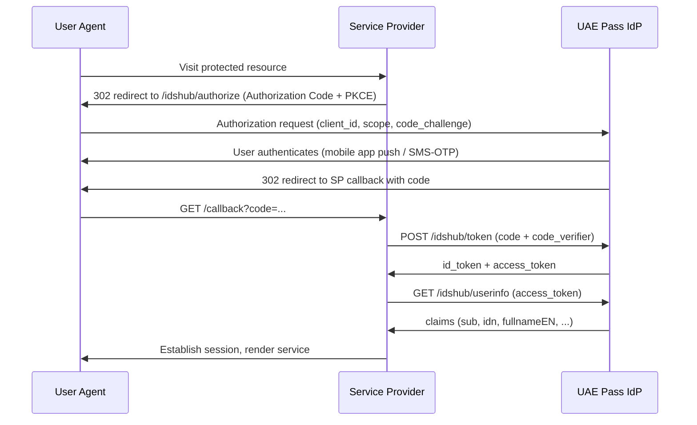

# UAE Pass Integration Design

> **Template Origin**: Community | **ArcKit Version**: [VERSION] | **Command**: `/arckit:uae-uaepass`

## Document Control

<!-- DOC-CONTROL-HEADER -->
<!-- Resolved at command-execution time per _partials/RENDERING.md. -->

## Revision History

| Version | Date | Author | Changes | Approved By | Approval Date |
|---------|------|--------|---------|-------------|---------------|
| [VERSION] | [YYYY-MM-DD] | ArcKit AI | Initial creation from `/arckit:uae-uaepass` | [PENDING] | [PENDING] |

## Executive Summary

[Two to three paragraphs describing the service's UAE Pass integration posture: which user journeys authenticate with UAE Pass, the chosen profile mix (Basic vs Verified), and any e-signature obligations.]

## Scope

| Item | Value |
|------|-------|
| Federal entity (Service Provider) | [name] |
| In-scope user journeys | [list] |
| User populations | [citizens / residents / visitors / employees] |
| Out-of-scope journeys (with rationale) | [list] |
| Service Provider category (TDRA / ICP onboarding) | [Public / Private / Government] |

## Authentication Flow Diagram

## Profile Selection (Basic vs Verified)

| User journey | Profile required | Rationale | Upgrade path if user arrives Basic-only |
|--------------|------------------|-----------|------------------------------------------|
| [journey] | [Basic / Verified] | [rationale] | [redirect to UAE Pass kiosk / video-KYC URL] |

> Verified profile requires prior Emirates ID verification. Basic profile is sufficient for read-only and low-assurance journeys; Verified is required for KYC-bound transactions and for any flow that uses UAE Pass e-signature.

## Claim Mapping

| UAE Pass claim | SP user-record field | Required? | Consent / privacy note |
|----------------|----------------------|-----------|------------------------|
| `sub` | `external_subject_id` | Y | Stable subject identifier — primary join key |
| `idn` (Emirates ID) | `emirates_id` | [Y/N] | Personal data — PDPL Article 5 lawful basis required |
| `fullnameEN` | `name_en` | [Y/N] | [note] |
| `fullnameAR` | `name_ar` | [Y/N] | [note] |
| `mobile` | `mobile` | [Y/N] | [note] |
| `email` | `email` | [Y/N] | [note] |
| `nationalityEN` | `nationality_en` | [Y/N] | [note] |
| `nationalityAR` | `nationality_ar` | [Y/N] | [note] |
| `gender` | `gender` | [Y/N] | [note] |
| `dob` | `date_of_birth` | [Y/N] | Sensitive — minimise retention |
| `profileType` | `uaepass_profile_type` | Y | Discriminates Basic vs Verified |

## Service Provider Onboarding Checklist

| Onboarding artefact | Status | Owner | Notes |
|---------------------|--------|-------|-------|
| Sandbox client credentials issued | [PENDING / DONE] | [owner] | [notes] |
| Production credentials request submitted | [PENDING / DONE] | [owner] | [notes] |
| Callback URL allow-list registered | [PENDING / DONE] | [owner] | [notes] |
| Branding pack supplied (logo, service name AR/EN) | [PENDING / DONE] | [owner] | [notes] |
| Security review completed (TDRA / ICP) | [PENDING / DONE] | [owner] | [notes] |
| Privacy notice updated to disclose UAE Pass claim usage | [PENDING / DONE] | [owner] | [notes] |
| Go-live readiness review | [PENDING / DONE] | [owner] | [notes] |

## E-signature Audit Trail Design

For every journey that invokes the UAE Pass e-signature endpoint, record:

| Field | Source | Storage | Retention |
|-------|--------|---------|-----------|
| Signed document hash | SP-computed (SHA-256) before signing request | [WORM store / records system] | [period] |
| Signed document (PDF/A) | UAE Pass signing response | [WORM store] | [period] |
| Signer subject identifier (`sub`) | UAE Pass `id_token` | [audit log] | [period] |
| Emirates ID (`idn`) | UAE Pass `id_token` (Verified only) | [audit log — encrypted] | [period] |
| Signature timestamp | UAE Pass response | [audit log] | [period] |
| Certificate chain | UAE Pass response | [audit log] | [period] |
| User consent artefact | SP-captured before signing | [audit log] | [period] |

State the legal-effect citation supporting non-repudiation of the signed artefact under UAE law.

## External References

### Document Register

| Doc ID | Title | URL | Verified date |
|--------|-------|-----|---------------|
| UAE-PASS-DEV | UAE Pass Developer Documentation | <https://docs.uaepass.ae/> | [YYYY-MM-DD] |

### Citations

| Citation | Doc ID | Section | Used in |
|----------|--------|---------|---------|
| [UPASS-1] | UAE-PASS-DEV | Authorization Code flow | Authentication Flow Diagram |
| [UPASS-2] | UAE-PASS-DEV | Profile types | Profile Selection (Basic vs Verified) |
| [UPASS-3] | UAE-PASS-DEV | UserInfo claims | Claim Mapping |
| [UPASS-4] | UAE-PASS-DEV | E-signature endpoint | E-signature Audit Trail Design |

### Unreferenced Documents

[List any documents read during generation but not cited, or "None".]

---

**Generated by**: ArcKit `/arckit:uae-uaepass` command
**Generated on**: [DATE]
**ArcKit Version**: [VERSION]
**Project**: [PROJECT_NAME]
**Model**: [AI_MODEL]
