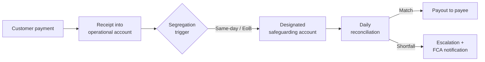

# UK EMI / PI Safeguarding Assessment

> **Template Origin**: Community | **ArcKit Version**: [VERSION] | **Command**: `/arckit:uk-fs-safeguarding`

## Document Control

<!-- Default: OFFICIAL. Upgrade to OFFICIAL-SENSITIVE if this document reveals the specific
     safeguarding bank account numbers, policy reference numbers, or shortfall thresholds that
     could be exploited if disclosed. Driven by user_config.default_classification. -->

| Field | Value |
|-------|-------|
| **Document ID** | {{DOCUMENT_ID}} |
| **Document Type** | UK EMI / PI Safeguarding Assessment |
| **Project** | {{PROJECT_NAME}} |
| **Classification** | {{CLASSIFICATION}} |
| **Status** | DRAFT |
| **Version** | 1.0 |
| **Created Date** | {{CREATED_DATE}} |
| **Last Modified** | {{LAST_MODIFIED}} |
| **Review Cycle** | Annual (minimum); review immediately on change of safeguarding bank, insurer, or product scope |
| **Next Review Date** | {{NEXT_REVIEW_DATE}} |
| **Owner** | {{DOCUMENT_OWNER_ROLE}} — {{DOCUMENT_OWNER_NAME}} |
| **Reviewed By** | PENDING |
| **Approved By** | PENDING |
| **Distribution** | {{DISTRIBUTION}} |
| **Firm Authorisation / Registration Type** | {{FIRM_AUTHORISATION_TYPE}} (EMI — authorised / API — authorised / SPI — registered) |
| **FCA Firm Reference Number** | {{FCA_FRN}} |
| **SMF Holder (Safeguarding)** | {{SMF_HOLDER_NAME}} — {{SMF_HOLDER_FUNCTION}} |

## Revision History

| Version | Date | Author | Changes | Approved By | Approval Date |
|---------|------|--------|---------|-------------|---------------|
| 1.0 | {{CREATED_DATE}} | ArcKit AI | Initial creation from `/arckit:uk-fs-safeguarding` command | PENDING | PENDING |

<!-- Add additional rows as needed -->

---

## Executive Summary

{{EXECUTIVE_SUMMARY_PARAGRAPH_1}}

{{EXECUTIVE_SUMMARY_PARAGRAPH_2}}

{{EXECUTIVE_SUMMARY_PARAGRAPH_3}}

> ⚠️ This document is a **working assessment** — not a regulatory submission. All safeguarding
> arrangements must be reviewed and signed off by qualified UK FS regulatory counsel, the firm's
> SMF holder for safeguarding (primary accountability — typically SMF1/SMF24 in larger firms), the
> firm's MLRO (for AML-angle review of the client-money position, not primary safeguarding
> accountability), and the firm's Compliance Officer before implementation. Regulatory citations
> reflect the position as at the document creation date; verify against current FCA publications —
> including the FCA Approach Document (May 2026 edition) and PS24/9 — before reliance.

---

## 1. Firm Authorisation / Registration Context

### 1.1 Authorisation or Registration Details

| Field | Value |
|-------|-------|
| **Legal entity name** | {{FIRM_NAME}} |
| **FCA Firm Reference Number** | {{FCA_FRN}} |
| **Authorisation / registration type** | {{FIRM_AUTHORISATION_TYPE}} (EMIs and APIs are *authorised*; SPIs are *registered*) |
| **Authorisation / registration date** | {{AUTHORISATION_DATE}} |
| **Applicable regulation** | {{APPLICABLE_REGULATION}} |
| **Passporting arrangements** | {{PASSPORTING_ARRANGEMENTS}} |
| **SMF holder(s) for safeguarding** | {{SMF_HOLDER_LIST}} |

### 1.2 In-Scope Payment Services and E-Money Products

{{IN_SCOPE_SERVICES_NARRATIVE}}

| Service / Product | Regulatory category | Relevant funds arise? | Notes |
|-------------------|---------------------|-----------------------|-------|
| {{SERVICE_1_NAME}} | {{SERVICE_1_CATEGORY}} | {{SERVICE_1_RELEVANT_FUNDS}} | {{SERVICE_1_NOTES}} |
| {{SERVICE_2_NAME}} | {{SERVICE_2_CATEGORY}} | {{SERVICE_2_RELEVANT_FUNDS}} | {{SERVICE_2_NOTES}} |
| {{SERVICE_3_NAME}} | {{SERVICE_3_CATEGORY}} | {{SERVICE_3_RELEVANT_FUNDS}} | {{SERVICE_3_NOTES}} |

<!-- Add additional rows as needed -->

### 1.3 Out-of-Scope Services

{{OUT_OF_SCOPE_SERVICES_NARRATIVE}}

---

## 2. Safeguarding Obligation Scope

### 2.1 Definition of Relevant Funds

"Relevant funds" for this firm are defined as: {{RELEVANT_FUNDS_DEFINITION}}

The safeguarding obligation arises at the moment of receipt of funds, not at the point of payment
initiation (EMR 2011 Reg 20; PSRs 2017 Reg 23).

### 2.2 Client Populations in Scope

| Client segment | Approximate funds volume (monthly) | Safeguarding obligation | Notes |
|----------------|-------------------------------------|-------------------------|-------|
| {{SEGMENT_1_NAME}} | {{SEGMENT_1_VOLUME}} | {{SEGMENT_1_OBLIGATION}} | {{SEGMENT_1_NOTES}} |
| {{SEGMENT_2_NAME}} | {{SEGMENT_2_VOLUME}} | {{SEGMENT_2_OBLIGATION}} | {{SEGMENT_2_NOTES}} |
| {{SEGMENT_3_NAME}} | {{SEGMENT_3_VOLUME}} | {{SEGMENT_3_OBLIGATION}} | {{SEGMENT_3_NOTES}} |

<!-- Add additional rows as needed -->

### 2.3 Exclusions

The following funds are **not** relevant funds and are therefore excluded from safeguarding scope:

{{EXCLUSIONS_NARRATIVE}}

---

## 3. Safeguarding Method Statement

### 3.1 Selected Method

**Safeguarding method**: {{SAFEGUARDING_METHOD}}

| Method | Applicable to this firm? | Regulatory basis | Notes |
|--------|--------------------------|------------------|-------|
| Segregation in designated safeguarding account | {{SEGREGATION_APPLICABLE}} | EMR 2011 Reg 20, Reg 21; PSRs 2017 Reg 23(2)–(11) | Primary method |
| Comparable guarantee | {{GUARANTEE_APPLICABLE}} | EMR 2011 Reg 22; PSRs 2017 Reg 23(12)–(13) | Alternative method |
| Insurance policy | {{INSURANCE_APPLICABLE}} | EMR 2011 Reg 22; PSRs 2017 Reg 23(12)–(13) | Alternative method |

### 3.2 Method Justification

{{METHOD_JUSTIFICATION_NARRATIVE}}

The firm has selected **{{SAFEGUARDING_METHOD}}** because: {{METHOD_SELECTION_RATIONALE}}

### 3.3 Commingling Controls

The following controls prevent commingling of relevant funds with the firm's own operational funds.
The commingling prohibition is set out in **EMR 2011 Reg 21(3)(b)** (the designated account "must
be used only for holding those funds or assets") and **PSRs 2017 Reg 23(6)**.

1. {{COMMINGLING_CONTROL_1}}
2. {{COMMINGLING_CONTROL_2}}
3. {{COMMINGLING_CONTROL_3}}

<!-- Add additional controls as needed -->

### 3.4 Segregation Trigger and Timing

| Event | Segregation deadline | Regulatory basis |
|-------|----------------------|------------------|
| Receipt of funds from customer (payment institution) | End of business day of receipt | PSRs 2017 Reg 23(2) |
| Receipt of funds for e-money issuance (EMI) | "by the end of five business days after the date on which the electronic money has been issued" (verbatim) | EMR 2011 Reg 20(4) |
| {{FIRM_SPECIFIC_TRIGGER}} | {{FIRM_SPECIFIC_DEADLINE}} | {{FIRM_SPECIFIC_BASIS}} |

<!-- Add additional rows as needed -->

> **FCA practice note**: The May 2026 Approach Document expects firms to minimise the float
> period between receipt and segregation in practice, even where the statutory deadline allows
> up to five business days. Firms should document the operational target alongside the statutory
> deadline.

---

## 4. Designated Safeguarding Arrangements

### 4.1 Designated Safeguarding Account(s)

> ⚠️ **Classification note**: If this section is completed with live account details (sort code,
> account number, IBAN), the document should be upgraded to OFFICIAL-SENSITIVE.

| Field | Value |
|-------|-------|
| **Safeguarding bank name** | {{SAFEGUARDING_BANK_NAME}} |
| **Safeguarding bank FCA FRN** | {{SAFEGUARDING_BANK_FRN}} |
| **Safeguarding bank FRN verified date** | {{SAFEGUARDING_BANK_FRN_VERIFIED_DATE}} |
| **Account type** | {{SAFEGUARDING_ACCOUNT_TYPE}} |
| **Account designation** | {{SAFEGUARDING_ACCOUNT_DESIGNATION}} |
| **Date designated** | {{SAFEGUARDING_ACCOUNT_DESIGNATION_DATE}} |
| **Currency(ies)** | {{SAFEGUARDING_ACCOUNT_CURRENCIES}} |
| **Backup safeguarding bank** | {{BACKUP_SAFEGUARDING_BANK_NAME}} |
| **Backup bank FCA FRN** | {{BACKUP_SAFEGUARDING_BANK_FRN}} |

> **CTP dependency note**: The safeguarding bank is a critical third-party dependency. It must be
> assessed in the firm's CTP dependency register. Use `/arckit:uk-fs-ctp-dependency` to produce
> that assessment.

### 4.2 Insurance Policy or Guarantee Arrangements (if applicable)

*Complete this section only if the firm uses the insurance or guarantee safeguarding method.
Mark as N/A if segregation is the sole method.*

| Field | Value |
|-------|-------|
| **Insurer / guarantor name** | {{INSURER_GUARANTOR_NAME}} |
| **Insurer / guarantor FCA FRN** | {{INSURER_GUARANTOR_FRN}} |
| **Policy / guarantee reference** | {{POLICY_GUARANTEE_REFERENCE}} |
| **Coverage amount** | {{COVERAGE_AMOUNT}} |
| **Policy / guarantee start date** | {{POLICY_START_DATE}} |
| **Policy / guarantee expiry date** | {{POLICY_EXPIRY_DATE}} |
| **Renewal review date** | {{POLICY_RENEWAL_REVIEW_DATE}} |
| **Trigger for payout into designated account** | {{INSOLVENCY_TRIGGER}} |

---

## 5. End-to-End Client Funds Flow

### 5.1 Funds Flow Diagram

```text
{{INSERT_FUNDS_FLOW_DIAGRAM_HERE}}
```

*Suggested Mermaid format:*



### 5.2 Funds Flow Narrative

| Stage | System / component | Data record created | Responsible team |
|-------|--------------------|---------------------|------------------|
| {{STAGE_1_NAME}} | {{STAGE_1_SYSTEM}} | {{STAGE_1_DATA_RECORD}} | {{STAGE_1_TEAM}} |
| {{STAGE_2_NAME}} | {{STAGE_2_SYSTEM}} | {{STAGE_2_DATA_RECORD}} | {{STAGE_2_TEAM}} |
| {{STAGE_3_NAME}} | {{STAGE_3_SYSTEM}} | {{STAGE_3_DATA_RECORD}} | {{STAGE_3_TEAM}} |
| {{STAGE_4_NAME}} | {{STAGE_4_SYSTEM}} | {{STAGE_4_DATA_RECORD}} | {{STAGE_4_TEAM}} |
| {{STAGE_5_NAME}} | {{STAGE_5_SYSTEM}} | {{STAGE_5_DATA_RECORD}} | {{STAGE_5_TEAM}} |

<!-- Add additional rows as needed -->

### 5.3 Intra-Day Float Management

{{INTRADAY_FLOAT_NARRATIVE}}

---

## 6. Reconciliation Cadence and Sign-Off Chain

{{INSERT_RECONCILIATION_BLOCK_HERE}}

---

## 7. Audit Plan

### 7.1 Internal Audit

| Audit element | Detail |
|---------------|--------|
| **Internal audit frequency** | {{INTERNAL_AUDIT_FREQUENCY}} |
| **Audit scope** | {{INTERNAL_AUDIT_SCOPE}} |
| **Lead auditor (internal)** | {{INTERNAL_AUDIT_LEAD}} |
| **Audit report recipient** | {{INTERNAL_AUDIT_REPORT_RECIPIENT}} |
| **Next scheduled audit date** | {{NEXT_INTERNAL_AUDIT_DATE}} |

### 7.2 External Audit

| Audit element | Detail |
|---------------|--------|
| **External auditor engaged?** | {{EXTERNAL_AUDITOR_ENGAGED}} |
| **External auditor name** | {{EXTERNAL_AUDITOR_NAME}} |
| **Engagement scope** | {{EXTERNAL_AUDIT_SCOPE}} |
| **Last external audit date** | {{LAST_EXTERNAL_AUDIT_DATE}} |
| **Next external audit date** | {{NEXT_EXTERNAL_AUDIT_DATE}} |

### 7.3 Regulator-Readable Evidence Pack

The following data and reports must be producible on FCA request, and are submitted via the monthly
safeguarding return (SUP 16 Annex 34A for payment institutions; SUP 16 Annex 34B for EMIs):

| Evidence item | Format | Retention period | Responsible system |
|---------------|--------|------------------|--------------------|
| Daily reconciliation records | {{RECON_FORMAT}} | 6 years (FCA SUP 16) | {{RECON_SYSTEM}} |
| Designated account bank statements | {{STATEMENT_FORMAT}} | 6 years | {{STATEMENT_SYSTEM}} |
| Shortfall notification log | {{SHORTFALL_LOG_FORMAT}} | 6 years | {{SHORTFALL_LOG_SYSTEM}} |
| SMF sign-off register | {{SIGNOFF_FORMAT}} | 6 years | {{SIGNOFF_SYSTEM}} |
| Insurance / guarantee policy documents | {{POLICY_DOC_FORMAT}} | 6 years | {{POLICY_DOC_SYSTEM}} |
| Monthly safeguarding return (REP-CRIM) | SUP 16 Annex 34A/34B format | 6 years | {{MONTHLY_RETURN_SYSTEM}} |

<!-- Add additional rows as needed -->

---

## 8. Failure Scenarios and Recovery

### 8.1 Safeguarding Bank Failure

| Element | Detail |
|---------|--------|
| **FSCS protection applicable?** | {{FSCS_APPLICABLE}} |
| **FSCS coverage limit** | {{FSCS_COVERAGE}} |
| **Second safeguarding bank available?** | {{SECOND_BANK_AVAILABLE}} |
| **Fund portability procedure** | {{FUND_PORTABILITY_PROCEDURE}} |
| **Insolvency priority claim basis** | PSRs 2017 Reg 23(5): payment service users' claims rank in priority to all other creditors |
| **Recovery time objective (RTO)** | {{SAFEGUARDING_BANK_FAILURE_RTO}} |
| **Recovery point objective (RPO)** | {{SAFEGUARDING_BANK_FAILURE_RPO}} |
| **FCA notification required?** | Yes — notify FCA immediately if safeguarding bank fails or terminates the relationship |

### 8.2 Reconciliation Shortfall

| Element | Detail |
|---------|--------|
| **Shortfall detection mechanism** | {{SHORTFALL_DETECTION}} |
| **Immediate containment action** | {{SHORTFALL_CONTAINMENT}} |
| **SMF notification trigger** | {{SMF_NOTIFICATION_TRIGGER}} |
| **FCA notification trigger** | {{FCA_NOTIFICATION_TRIGGER}} |
| **Remediation timeline** | {{SHORTFALL_REMEDIATION_TIMELINE}} |
| **Root cause analysis process** | {{RCA_PROCESS}} |

### 8.3 Payout Blockage

| Scenario | Cause | Response | Owner |
|----------|-------|----------|-------|
| Sanctions screening freeze | OFAC/OFSI match on safeguarding account | Escalate to MLRO; engage compliance counsel; notify FCA | MLRO |
| Bank technical outage | Safeguarding bank system failure | Activate backup safeguarding bank; notify clients within {{CLIENT_NOTIFICATION_SLA}} | CFO / Treasurer |
| Regulatory restriction order | FCA or court order restricting account | Engage legal counsel immediately; notify board | CEO / SMF holder |

<!-- Add additional rows as needed -->

---

## 9. References

| Reference | Citation | URL |
|-----------|----------|-----|
| EMR 2011 Reg 20 | Electronic Money Regulations 2011 — Regulation 20: Safeguarding | <https://www.legislation.gov.uk/uksi/2011/99/regulation/20> |
| EMR 2011 | Electronic Money Regulations 2011 (SI 2011/99) — full instrument | <https://www.legislation.gov.uk/uksi/2011/99> |
| PSRs 2017 Reg 23 | Payment Services Regulations 2017 — Regulation 23: Safeguarding | <https://www.legislation.gov.uk/uksi/2017/752/regulation/23> |
| PSRs 2017 | Payment Services Regulations 2017 (SI 2017/752) — full instrument | <https://www.legislation.gov.uk/uksi/2017/752> |
| FCA Approach Document | Payment Services and Electronic Money — Our Approach (FCA, May 2026) | <https://www.fca.org.uk/publication/finalised-guidance/payment-services-electronic-money-approach.pdf> |
| FCA PS24/9 | PS24/9 — Safeguarding reforms for payment and e-money firms (2024) | <https://www.fca.org.uk/publication/policy/ps24-9.pdf> |
| FCA CP22/25 | CP22/25 — Improving outcomes for consumers of payment and e-money firms | <https://www.fca.org.uk/publication/consultation/cp22-25.pdf> |
| FCA SUP 16 | SUP 16 — Reporting requirements (entry point for Annex 34A/34B monthly safeguarding return) | <https://www.handbook.fca.org.uk/handbook/SUP/16/> |
| FCA key publications | FCA EMI and Payment Institutions — key publications | <https://www.fca.org.uk/firms/emi-payment-institutions-key-publications> |

---

**Generated by**: ArcKit `/arckit:uk-fs-safeguarding` command
**Generated on**: [DATE]
**ArcKit Version**: [VERSION]
**Project**: [PROJECT_NAME]
**Model**: [AI_MODEL]
